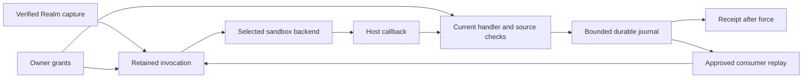

# Hosts retain Realm authority across sandbox execution

A host admits a captured Realm artifact and its requested capabilities before executing code.
The selected backend receives the program, bounded arguments and mediated callbacks. It does
not receive a World object, host filesystem path, credential store or provider token.

## Admission

An invocation retains its World, Realm installation, artifact digest, approval revision and
handler. Every host effect checks that retained authority. Retries and nested calls preserve
it; a newer approval does not authorize an older invocation. Removing a grant blocks later
operations but cannot undo an effect that has already completed.

A source grant has its own revision. It remains stable across unrelated handler or consumer
approval changes, allowing self-consumption and cyclic pipelines. Removing and reapproving a
source, changing its artifact or reinstalling the Realm invalidates the old source reference.
The host allocates revisions; Realm declarations and guest arguments cannot assign them.



## Data pipes

A channel is a general data pipe. Discord messages, webhook events, database change feeds
and Realm-produced events can supply it. A channel may be inbound, outbound or bidirectional;
a live conversational connection is one provider adapter.

`data-pipes.yml` version 1 declares sources and consumers:

```yaml
version: 1
sources:
  - name: changes
    stream: events
    type: note.changed
consumers:
  - name: archive
    handler: notes.store
```

Either list may be omitted. Source and consumer names are unique within their own lists.
A source supplies its name, partition stream and event type. A consumer supplies its name
and a captured `namespace.function` handler. Neither declaration supplies credentials or
selects an owner World. Consumer names identify independent cursors.

Source approval grants publication. Consumer approval grants access to one exact source
reference and requires separate handler approval. Host-source references bind a World,
provider registration, source revision and stream. Realm-source references bind a World,
Realm installation, artifact digest, source name, source-grant revision and stream.

A host must reject unknown declaration fields, duplicate names or keys, YAML aliases/tags,
malformed Unicode and scalar coercion. The governed reference implementation limits the
file to 64 KiB and each list to 128 entries. Source field values are nonblank, exclude control
characters and occupy at most 256 UTF-8 bytes.

## Publication

A captured handler uses `gateway.channel.publish`; Wasm handlers access it through
`ctx.gateway.channel.publish`:

```typescript
const receipt = await gateway.channel.publish({
  source: "changes",
  eventId: input.eventId,
  streamId: input.streamId,
  occurredAt: input.occurredAt,
  payload: { noteId: input.noteId },
});
```

All five fields are required. `occurredAt` is an ISO instant and `payload` is a JSON object.
The host derives the owner, installation, event type and partition from the retained target
and verified declaration. `streamId` identifies a logical event stream within that partition.
It does not select another source or World.

Publication returns `{receiptId, offset, replayed}` after the durable append. Keep the event
ID, timestamp and payload stable on retry. An identical retry returns the original receipt;
conflicting content for the same event identity is refused. A receipt confirms acceptance,
not completed downstream effects.

The governed reference implementation accepts at most 64 KiB UTF-8 JSON with nesting depth
32. It rejects extra fields, duplicate keys, trailing JSON and invalid Unicode. Publication
requires a retained captured invocation; there is no generic HTTP publication tool.

## Replay

A consumer receives `offset`, `eventId`, `streamId`, `type`, `occurredAt`, `gap` and `payload`.
The envelope omits host paths, credentials and authority selectors. Processing retains the
source and consumer grants through host callbacks and nested calls. A checkpoint advances
only after the handler succeeds and admission remains current.

Delivery is at least once. A failed or interrupted handler keeps its durable offer for retry;
external effects need their own stable idempotency key. A completed Signal Bus handoff does
not confirm completion by every bus listener.

The reference implementation restores Realm source bindings on World load and rebuild.
After restart, replay begins when the owner World loads through startup warming or first
access. Provider connectors retain a separate approved lifecycle. Source discovery starts
no guest execution; the bounded replay scheduler performs delivery.

## Capacity

Every Realm has finite host-enforced execution and storage limits. A dependency declaration
cannot increase them. Journal records, consumer control frames and recovery metadata count
against host storage policy. Exceeding a limit must refuse new writes without acknowledging
an uncommitted append or deleting unread records.

The reference journal defaults to 64 MiB shared across the host and 8 MiB of retained frame
bytes per World and Realm installation. A separate free-space check reserves 64 MiB. The
per-Realm charge spans all source names and streams. Reinstalling does not reclaim the old
installation's bytes from the shared limit. A full budget can block new offers or checkpoints;
automatic compaction and retention are not implemented.

## Credentials and databases

Credentials remain in owner-scoped host storage. Guests refer to approved operations and
sources; they do not receive token values, wallet key names or a general credential lookup.
The host must constrain credential use to the approved destination and operation and keep
secrets out of guest results, error messages and logs. Ambient process environment variables
are not authority for a governed Realm.

External SQL belongs behind bound Virtual Cypher, approved producers or typed operations.
Use `params` for query values, including lists and nested objects. Raw `gateway.sql` access
is not a portable guest capability. Owner database setup selects a host-configured target
and its digest before storing credentials; target approval alone does not make it queryable.

A private SQLite dependency serves the Realm's own computation or persistence. Its database,
WAL, snapshots and recovery overhead must fit that Realm's finite budget. It grants no access
to an external datasource. The host channel journal is a separate delivery facility.

## Backends and dependencies

The contract separates admission from backend selection. A host may implement Wasm, Docker
or another isolated backend while preserving retained identity, bounded I/O, mediated effects
and refusal behavior. A remote backend must preserve those checks and authenticate its
transport; backend placement does not grant access to credentials.

Captured Docker execution can load bundled CommonJS and JSON artifacts from
`dist/node_modules/`. The reference host verifies at most 256 runtime entries totaling 8 MiB
and resolves package main/index, subpaths, relative modules and cycles inside the container.
Missing imports have no host fallback. Package exports maps, ESM and native module loading
are unsupported. Bundled code receives no additional authority or credentials.

Dependency and storage capabilities require explicit host support. Unsupported requirements
must be rejected before execution. Portable dependency negotiation and private database
persistence remain open. This document does not introduce dependency or VFS syntax.

## Reference implementation

The governed implementation is tracked in [embabel/me#1091](https://github.com/embabel/me/pull/1091).
Its current support is narrower than some trusted-host examples in the main specification:

| Capability | State |
| --- | --- |
| Captured Wasm and Docker handlers, type methods and schedules | Implemented with retained approval checks. |
| Approved provider lifecycle and durable journal delivery | Implemented for Discord, Slack and Telegram. |
| Captured source/consumer approval and publication | Implemented with World-load source discovery. |
| Captured callback to an approved sibling | Implemented within the same installation. |
| Captured Virtual Cypher and other host-resource callbacks | Refused pending retained resource receivers. |
| Owner database target approval | Implemented; runtime datasource use still needs integration. |
| Captured Docker CommonJS dependencies | Implemented for bounded, verified bundles; no runtime package installation. |
| Dependency negotiation, private Realm database persistence and VFS | Not implemented on this path. |
| Firecracker, generalized remote backends and resumable arbitrary computation | Not implemented. |

Hosts must state which profile and capabilities they support. Generated types describe an
operation's contract; they do not grant permission or prove receiver availability.
