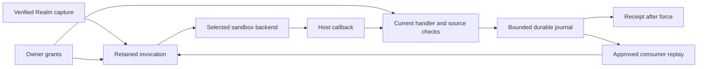

# Hosts retain Realm authority across sandbox execution

A host admits a captured Realm artifact and its requested capabilities before executing code.
The selected backend receives the program, bounded arguments and mediated callbacks. It does
not receive a World object, host filesystem path, credential store or provider token.

## Admission

An invocation retains its World, Realm installation, artifact digest, approval revision and
handler. Every host effect checks that retained authority. Retries and nested calls preserve
it; a newer approval does not authorize an older invocation. Removing a grant blocks later
operations but cannot undo an effect that has already completed.

A source grant has its own revision. It remains stable across unrelated handler or consumer
approval changes, allowing self-consumption and cyclic pipelines. Removing and reapproving a
source, changing its artifact or reinstalling the Realm invalidates the old source reference.
The host allocates revisions; Realm declarations and guest arguments cannot assign them.



## Data pipes

A channel is a general data pipe. Discord messages, webhook events, database change feeds
and Realm-produced events can supply it. A channel may be inbound, outbound or bidirectional;
a live conversational connection is one provider adapter.

`data-pipes.yml` version 1 declares sources and consumers:

```yaml
version: 1
sources:
  - name: changes
    stream: events
    type: note.changed
consumers:
  - name: archive
    handler: notes.store
```

Either list may be omitted. Source and consumer names are unique within their own lists.
A source supplies its name, partition stream and event type. A consumer supplies its name
and a captured `namespace.function` handler. Neither declaration supplies credentials or
selects an owner World. Consumer names identify independent cursors.

Source approval grants publication. Consumer approval grants access to one exact source
reference and requires separate handler approval. Host-source references bind a World,
provider registration, source revision and stream. Realm-source references bind a World,
Realm installation, artifact digest, source name, source-grant revision and stream.

A host must reject unknown declaration fields, duplicate names or keys, YAML aliases/tags,
malformed Unicode and scalar coercion. The governed reference implementation limits the
file to 64 KiB and each list to 128 entries. Source field values are nonblank, exclude control
characters and occupy at most 256 UTF-8 bytes.

## Publication

A captured handler uses `gateway.channel.publish`; Wasm handlers access it through
`ctx.gateway.channel.publish`:

```typescript
const receipt = await gateway.channel.publish({
  source: "changes",
  eventId: input.eventId,
  streamId: input.streamId,
  occurredAt: input.occurredAt,
  payload: { noteId: input.noteId },
});
```

All five fields are required. `occurredAt` is an ISO instant and `payload` is a JSON object.
The host derives the owner, installation, event type and partition from the retained target
and verified declaration. `streamId` identifies a logical event stream within that partition.
It does not select another source or World.

Publication returns `{receiptId, offset, replayed}` after the durable append. Keep the event
ID, timestamp and payload stable on retry. An identical retry returns the original receipt;
conflicting content for the same event identity is refused. A receipt confirms acceptance,
not completed downstream effects.

The governed reference implementation accepts at most 64 KiB UTF-8 JSON with nesting depth
32. It rejects extra fields, duplicate keys, trailing JSON and invalid Unicode. Publication
requires a retained captured invocation; there is no generic HTTP publication tool.

## Polling positions

A captured poller reads its source cursor with `gateway.channel.position({source})`, which
returns `{position: string | null}`. It commits a page through `gateway.channel.publishBatch`:

```typescript
const { position } = await gateway.channel.position({ source: "changes" });
const receipt = await gateway.channel.publishBatch({
  source: "changes",
  batchId: page.id,
  expectedPosition: position,
  nextPosition: page.nextCursor,
  events: page.events,
});
```

Each event has `eventId`, `streamId`, `occurredAt` and object `payload`, with the same meaning
as single publication. All batch fields are required; only `expectedPosition` may be null.
The host appends the events and cursor change in one journal frame. A mismatched expected
position refuses the batch. An empty event list may advance the cursor. The receipt contains
`receiptId`, `offsets` and `replayed`.

Keep the batch ID, event identities, original timestamps, payloads and both positions stable
when retrying a page. An identical retry returns its original receipt; changed content under
the same batch ID is refused. A frame may already be durable when admission is revoked and
the response is refused. Admission is checked after force and before returning to the guest;
a retry still needs current authority. Receipt replay does not repeat the cursor update.

Position reads and batches require the current handler and same-installation source grant.
Requests cannot select an owner, World, installation or event type. A cursor belongs to the
logical source and its declared partition stream, not an event's `streamId`. Approving an
updated artifact preserves that logical cursor. A provider change or incompatible cursor
format needs a new source/stream identity or an explicit migration.

The reference host limits position requests to 8 KiB of UTF-8 JSON and batches to 1 MiB with
at most 256 events. Positions are nonblank opaque strings of at most 4 KiB UTF-8, without NUL.
Strict JSON parsing, journal payload limits and host/Realm storage caps also apply. These
callbacks work through Wasm and Docker. They support Realm-authored pollers using approved
schedules and API operations; automatic provider polling and webhook adapters remain separate.

## Replay

A consumer receives `offset`, `eventId`, `streamId`, `type`, `occurredAt`, `gap` and `payload`.
The envelope omits host paths, credentials and authority selectors. Processing retains the
source and consumer grants through host callbacks and nested calls. A checkpoint advances
only after the handler succeeds and admission remains current.

Delivery is at least once. A failed or interrupted handler keeps its durable offer for retry;
external effects need their own stable idempotency key. A completed Signal Bus handoff does
not confirm completion by every bus listener.

The reference implementation restores Realm source bindings on World load and rebuild.
After restart, replay begins when the owner World loads through startup warming or first
access. Provider connectors retain a separate approved lifecycle. Source discovery starts
no guest execution; the bounded replay scheduler performs delivery.

## Legacy event declarations

The reference host excludes live Realm `events/` files from runtime loading when captured
execution is selected. This covers scheduled polls, manual polls, webhook event projection
and declared-signal discovery, including a World previously loaded in compatibility mode.
The host checks the execution model before resolving live Realm directories.

Captured data-pipe publication and approved channel consumers keep their existing paths.
Generic captured polling and webhook event manifests remain unsupported. Explicit owner
webhook actions use a separate route. Declaration reads for authoring do not register a
source or grant execution.

## Capacity

Every Realm has finite host-enforced execution and storage limits. A dependency declaration
cannot increase them. Journal records, consumer control frames and recovery metadata count
against host storage policy. Exceeding a limit must refuse new writes without acknowledging
an uncommitted append or deleting unread records.

The reference journal defaults to 64 MiB shared across the host and 8 MiB of retained frame
bytes per World and Realm installation. A separate free-space check reserves 64 MiB. The
per-Realm charge spans all source names and streams. Reinstalling does not reclaim the old
installation's bytes from the shared limit.

By default, the reference journal reserves 25% of frame capacity for consumer control writes,
within both existing caps. The shared percentage applies after its metadata allowance.
Appends stop at the lower ceiling; adoption, offers and checkpoints may use the remaining
capacity. All frames consume append capacity. Hosts may configure 0–50%; zero disables the
reserve. Changing it affects new appends without rewriting existing data. A full total budget
can still block offers or checkpoints. Automatic compaction and retention are not implemented;
crash-safe replacement and recovery must also fit within the storage budget.

## Credentials and databases

Credentials remain in owner-scoped host storage. Guests refer to approved operations and
sources; they do not receive token values, wallet key names or a general credential lookup.
The host must constrain credential use to the approved destination and operation and keep
secrets out of guest results, error messages and logs. Ambient process environment variables
are not authority for a governed Realm.

External SQL belongs behind bound Virtual Cypher, approved producers or typed operations.
Use `params` for query values, including lists and nested objects. Raw `gateway.sql` access
is not a portable guest capability. Owner database setup selects a host-configured target
and its digest before storing credentials; target approval alone does not make it queryable.
Upgrade and revocation require the current installation and revision. Replacement approval
invalidates old access before removing its credentials. Revocation requires no database
connection and remains available when the configured target has been removed.

A private SQLite dependency serves the Realm's own computation or persistence. Its database,
WAL, snapshots and recovery overhead must fit that Realm's finite budget. It grants no access
to an external datasource. The host channel journal is a separate delivery facility.

## Captured API operations

A captured Realm may declare approved API operations in `apis/apis.yml` using vendored
OpenAPI documents. Each operation binds a fixed destination and a key from the owner's
wallet. In the governed profile, `token-env` identifies a wallet entry; it does not authorize
an environment-variable fallback. The guest supplies operation arguments, never credentials,
headers, server overrides or an alternative URL.

Owner preview shows the captured digest, installation revision, operation destination and
required wallet key name. Grant and revoke requests select the displayed installation and
revision. Granting an operation binds the current wallet value. Changing or deleting that
value prevents its use while the value is absent or differs from the approved value.
A different value requires approval. Restoring the identical approved value resumes access;
explicit operation or Realm revocation prevents that. Revocation remains available after
key deletion. These mutations advance the Realm installation revision, so
older retained invocations become stale.

The host checks the retained handler, consumer and operation grants and current credential
binding before network access and before returning data. API approval does not grant access
to another operation. Provider responses and errors must not expose the injected credential.
The provider itself is trusted with that credential: rejecting common echoes cannot prove
that a malicious provider has not transformed it into other response data. Revocation cannot
undo a request already accepted by the provider.

The reference profile supports:

| Declaration | Support |
| --- | --- |
| Specification | Vendored OpenAPI 3 JSON under `apis/`; no remote documents or external references. |
| Destination | One fixed HTTPS origin per API, port 443, validated public addresses and verified TLS hostname; no redirects. |
| Operations | Explicit GET operation IDs, at most 128 per Realm. |
| Arguments | At most 64 scalar path/query parameters and 64 KiB JSON; no body or caller headers. |
| Validation | Types, required fields, enum and string-length limits; numeric ranges and regex annotations remain provider validation. |
| Authentication | API key in a query parameter or header, or HTTP bearer token; optional fixed `X-` headers. |
| Response | At most 1 MiB of strict UTF-8 JSON; common credential echoes and diagnostic exception text are refused. |

The initial implementation rejects unsupported auth schemes, parameter references, alternative
servers, mutations and credential injection into HTTP framing/control headers. In captured
Worlds, live Realm API declarations do not create legacy tools or trigger credential
resolution. Approved operations are also available directly through the owner gateway and
its generated descriptors. An API-only Realm needs operation approval but no handler grant
or executable program. Previously discovered tools must refuse after an installation revision
change or revocation and while the wallet value differs from the approved value. Direct tools
retain the captured API contract even if source files change.

Captured API namespaces cannot shadow ordinary gateway tools or captured handlers. The
shared producer, enrichment, query-bound-operation and generic signal catalogs exclude
direct captured API tools until those callers carry retained authority. A legacy Realm
callback cannot use a direct owner tool to bypass its captured callback requirements.
Explicitly owner-authored World APIs keep their separate path. The API profile provides
neither a general credential lookup nor complete OpenAPI schema validation. Captured
handler producers can use the same approved API receiver. Graph-backed lens integration
remains open.

### Result admission

After a handler completes, the host rechecks its original retained target before returning
the result. Realm revocation, installation revision changes, lost consumer/source constraints
and interruption refuse a late result. The host does not replace stale authority with a
newer approval. Completed effects cannot be undone by this check.

## Backends and dependencies

The contract separates admission from backend selection. A host may implement Wasm, Docker
or another isolated backend while preserving retained identity, bounded I/O, mediated effects
and refusal behavior. A remote backend must preserve those checks and authenticate its
transport; backend placement does not grant access to credentials.

Captured Docker execution can load bundled CommonJS and JSON artifacts from
`dist/node_modules/`. The reference host verifies at most 256 runtime entries totaling 8 MiB
and resolves package main/index, subpaths, relative modules and cycles inside the container.
Missing imports have no host fallback. Package exports maps, ESM and native module loading
are unsupported. Bundled code receives no additional authority or credentials.

A Realm can declare exact package requirements in `dependencies/manifest.json`:

```json
{
  "version": 1,
  "runtime": "typescript",
  "dependencies": [
    { "ecosystem": "npm", "name": "formatters", "version": "1.2.3" }
  ]
}
```

The document is limited to 64 KiB and 128 unique ecosystem/name pairs. Nonempty
requirements need version 1. Unknown fields, duplicates, malformed values and version
ranges are refused. The optional runtime marker retains its existing language meaning.
An absent or empty dependency list requests no host packages.

The selected backend must admit every requirement before binding and execution. A backend
with no package support refuses nonempty requests. Requirements remain bound to captured
program content; editing source files does not change them. Declarations do not select a
sandbox, registry, command, path or credential.

The reference Docker adapter accepts bundled npm packages with matching name and exact
semantic version in `dist/node_modules/<name>/package.json`. Metadata is strict JSON with
a 64 KiB limit. The entrypoint must exist within the package, using supported CommonJS/JSON
file or index resolution. Exports maps, ESM and `gypfile: true` are refused; native modules
remain unsupported. These declarations check required root packages; they do not limit
imports from other modules already included in the same bounded capture.

No download, installation or registry resolution occurs. Libraries compiled into a Wasm
program remain part of that artifact; the reference Wasm backend supplies no host packages.
Other ecosystems, runtime provisioning and private database persistence remain open.
Unsupported storage requirements must be rejected before handler execution. No VFS syntax
is introduced here.

## Reference implementation

The governed implementation is tracked in [embabel/me#1091](https://github.com/embabel/me/pull/1091).
Its current support is narrower than some trusted-host examples in the main specification:

| Capability | State |
| --- | --- |
| Captured Wasm and Docker handlers, type methods and schedules | Retained approval checks; scheduled calls also require the action process caller to match the owner World. The bounded handler schema profile validates inputs before dispatch and outputs before final admission. |
| [Captured command aliases](README.md#commands) | Strict versioned metadata, owner discovery and direct chat dispatch to approved same-installation handlers. |
| Approved provider lifecycle and durable journal delivery | Implemented for Discord, Slack and Telegram. |
| Captured source/consumer approval and publication | Implemented with World-load source discovery. |
| Scheduled API-to-channel handlers | Verified composition of captured schedules, approved GET operations, durable publication and consumer replay. Provider cursor persistence remains open. |
| Captured callback to an approved sibling | Implemented within the same installation. |
| Captured API operations and wallet bindings | Implemented for the GET profile; Movie Wasm tests cover query-key and header-key authentication. |
| Captured handler lenses | Versioned same-installation bindings; bounded JSON results, original-target refresh and prepared background runs. Completion and response checks retain admission; revocation clears stored data. Active work and settled storage are capped. Cache reuse is disabled. Opt-in content results hydrate owned focus under retained graph approval and select compatible built-in views; executable presentations are excluded. |
| Legacy Realm lenses | Excluded in captured Worlds, including previously loaded definitions and retained views. Owner lenses remain available; cached results are isolated by owner. Versioned handler bindings use the captured route. |
| Captured handler producers | Version-1 same-installation bindings, JSON batch keys and bounded record arrays. Owner precedence, retained World/approval checks, cancellation and call budgets apply. No result cache, paging or pushdown. Graph materialization preserves owner boundaries and host metadata. |
| Collection sources and mirrors | Captured complete-snapshot receiver with separate read/storage grants, atomic private records and coverage, authority-partitioned caches and finite capacity. Public declarations need matching host policy and never publish shared nodes. |
| Captured Virtual Cypher | Implemented owned reads and same-installation captured producers/collections with retained resource grants and rollback materialization. |
| Owner database target approval | Adoption, upgrade and revocation implemented; runtime datasource use still needs integration. |
| Captured Docker CommonJS dependencies | Implemented for bounded, verified bundles; no runtime package installation. |
| Additional dependency ecosystems, private Realm database persistence and VFS | Not implemented on this path. |
| Firecracker, generalized remote backends and resumable arbitrary computation | Not implemented. |

Hosts must state which profile and capabilities they support. Generated types describe an
operation's contract; they do not grant permission or prove receiver availability.

## Me captured graph-query profile


`ctx.gateway.cypher.query({cypher, params})` reads owned graph data and returns
`{rows, warnings, coverage}`. Pass values through `params`, as a JSON object or a JSON string.
The owner must approve `cypher_query` separately from the handler. List resources at
`GET /realms/{realmName}/resource-approvals`; grant or revoke with
`POST /realms/{realmName}/resource-approvals/cypher_query/{grant|revoke}` and
`{installationId, expectedRevision}`. Each change advances the installation revision.

Name every node and end the statement with a literal `LIMIT` between 1 and 512.
Every matched node must carry consistent ownership for the caller. Shared-label
exemptions, explicit sharing, anonymous nodes, variable-length paths, collection
construction, procedures and model-backed functions are outside this profile.
Ordinary scalar functions and numeric aggregates are supported. Named host views,
global source mirrors and diagnostic probes are not expanded or invoked. Captured collections use the retained snapshot profile below.

Queries use the existing scoped Cypher executor and virtual join engine. Only
captured producers from the same installation can run. Their callbacks retain the
querying handler's admission and each API operation still needs its own approval.
Legacy SQL, model-backed producers and implicit identity enrichment are excluded.
Producer records have no shared query cache, and materialization is rolled back.

Requests are capped at 128 KiB, with 16 KiB statements and 128 parameters. Results
are capped at 512 rows and 1 MiB. The Neo4j runner uses a 15-second transaction
limit and buffers at most 4,096 rows or 4 MiB per internal statement. These buffering
limits apply after driver decoding; database memory limits remain deployment
configuration. Engines without a bounded runner refuse captured queries.

```typescript
const result = await ctx.gateway.cypher.query({
  cypher: "MATCH (b:Bill) WHERE b.status = $status RETURN b LIMIT 100",
  params: { status: "unpaid" },
});
```

`CapturedRealmQueriesTest` covers real Wasm and Docker, owned graph reads, retained grants,
same-installation producer materialization, rollback and nested API readmission.

## Authenticated source ingress

An authenticated owner can append an external event to an approved captured source:

```http
POST /api/v1/channels/sources/{realmName}/{sourceName}/events
Content-Type: application/json
```

```json
{"installationId":"<approved installation>","sourceRevision":1,"event":{"eventId":"provider-event-42","streamId":"room-7","occurredAt":"2026-09-09T00:00:00Z","payload":{"text":"hello"}}}
```

Read installation and source revision from the source approval endpoint. Source revisions
survive unrelated handler approval changes; revoking and granting the source creates a new
revision. The owner and selected World come from authentication, and the stream and event
type come from the verified declaration. Payload fields cannot override that authority.
The request is strict JSON, at most 64 KiB, with the journal's existing event limits.

HTTP 200 returns `{receiptId, offset, replayed}` after durable append. Retry the exact event
ID and content after an uncertain response; a restart returns the same receipt. Changed
content for an existing event ID returns 409. Capacity returns 429 and storage failure 503.
Admission is checked again during the write. Acknowledgment confirms storage, not successful
consumer execution. World load restores approved source bindings and replays pending offers.

This route uses the host's owner authentication. It does not mint an ingress-only token or
verify provider-specific webhook signatures. Providers that require their own signature or
reply protocol need a host adapter. Source IDs and payload fields are not credentials.

### Legacy executable migration

Me does not load Realm `actions/`, `goals/` or `mcp/` files as host StepSpecs or
subprocess registrations. Owner configuration retains those host features. Compile
Realm code into captured manifest handlers and bind commands, function schedules,
producer handlers, lenses or data-pipe consumers. Captured declarative goals and
MCP/GraphQL transports require dedicated profiles; host declarations do not grant
those capabilities.

## Approved SQL callers

Production SQL reads and introspection use `OwnerSqlConnections`. The facade resolves the
current authenticated owner and selected World, then retains the exact datasource approval,
configured PostgreSQL target digest and scoped wallet credential. A legacy datasource YAML
entry cannot choose a production connection or credential. Discovery lists current owner
approvals. There is no environment or generic wallet-key fallback on this connection path.

Connections use the configured certificate policy and driver timeouts. Reads run in a
read-only transaction with 15-second statement and three-second lock limits, then roll back.
The receiver rechecks owner/World, approval and credential before use and after projection.
The facade accepts a single SELECT and binds values with prepared statements. Results are
limited to 1,024 rows, 128 columns and 1 MiB of encoded row data; overflow is unavailable rather than a partial
success. These limits apply after driver value decoding. Database permissions and server
memory limits remain deployment policy.

The current approval profile is read-only. Updates and stored procedures are unavailable,
and writable procedure tools are not exposed. Reads, metadata discovery and learning require
an authenticated owner context; a supplied user ID alone is insufficient. Connection failures
return fixed messages without JDBC URLs, driver errors or credentials.

Migrate old owner datasource files by selecting and approving a configured target through
Connect, then reference its target ID in Virtual Cypher producers or typed operations.
Raw SQL remains excluded from captured guest operations. Private SQLite remains a separate
bounded dependency use case. Tests for legacy SQL compilation and local database behavior
use an explicit test-only connection adapter; production has no legacy connection fallback.

## Captured browser apps

A browser app needs its own explicit approval for an exact captured entry point. Handler
approval alone does not approve an app. Its HTML and handler allowlist belong to the same
World, installation and digest as that approval.

The reference browser profile accepts `apps/<name>.html` (or `.htm`) with a matching
`apps/<name>.html.app.json` declaration:

```json
{"version":1,"handlers":["notes.list"]}
```

Only `version` and `handlers` are accepted. Handler names are unique and must appear in the
same captured handler manifest. The reference limits are 32 apps per capture, 32 handlers
per app, 8 KiB per declaration and 1 MiB of UTF-8 HTML per entry point. Unknown fields,
duplicate JSON keys and unsupported versions are refused.

The browser receives a `realm.call(handler, arguments)` function. It returns a promise for
the handler's JSON result, or rejects when the operation is refused or unavailable. Arguments
must be a JSON object. The selected handler must be declared by the app and independently
approved. Its API, query and channel capabilities retain their separate grants. A request
cannot select an owner, World, capture or installation through its arguments.

Realm HTML runs in an opaque browser sandbox. It cannot read the owner page's storage,
cookies or DOM, call arbitrary owner APIs, open popups or submit forms. The reference
profile requires self-contained HTML with inline or embedded assets; direct network access
and the general owner app runtime are unavailable. Bundle external code and styles during
authoring. Realm JavaScript and templates cannot be imported into owner-origin pages through
app-serving URLs. Owner-authored workspace apps and trusted World-template apps retain
the host's owner app runtime.

The host mediates calls through a document-bound message channel and a retained session.
App and handler approval, installation revision and expiry remain attached to nested calls,
host callbacks and final result release. Revocation or any installation revision change
invalidates the session. The reference host permits one active call, up to 256 calls and a
15-minute lifetime per session, with at most 16 sessions per owner and 256 per host. Restart
discards sessions. Opening a new session requires current approval. The bridge does not retry
effects automatically; a refused response cannot undo an effect that already completed.

In the reference owner API, `GET /api/v1/realm-browser/{realm}/approvals` lists the current
installation, revision, digest, app names, declared handlers and approval state.
`POST /api/v1/realm-browser/{realm}/approvals/{name}/grant` and `/revoke` take exactly
`installationId` and `expectedRevision`. A stale revision returns 409. Open an approved app
at `/apps/{realm}/{name}`. Existing flat links retain name-resolution precedence.

## Delegated source ingress

A host may issue an append-only bearer credential for one approved captured source. The
credential MUST retain the owner World, installation identity, capture digest and exact
source revision. Possession authorizes only source append, never owner authentication,
approval changes, reads or unrelated routes. Source removal/reapproval, capture change and
reinstall invalidate the old binding. Unrelated approval changes may preserve source
revision. Provider webhook signatures require a separate profile.

Only a cryptographic verifier of a high-entropy secret may persist. The host returns the
secret once at issue/rotation, does not expose it in metadata listings, and requires secure
transport. Credentials travel in the Authorization header, not event payloads or query
parameters. The host derives attribution and limits independently of untrusted event data.

Append MUST commit event, attribution, receipt and quota consumption atomically. Exact
response-loss retries return the same receipt without spending quota again. Rotation MUST
invalidate the old verifier while preserving delegation identity, expiry, quota and retry
identity. Expiry and revocation deny new appends and receipt replay; a recorded event does
not restore authority. A different delegation cannot reuse another submitter's event ID to
claim its receipt. Consumers require their own current source/consumer admission.

### Me delegated-ingress profile

Owner endpoints are `/api/v1/channels/sources/{realmName}/{sourceName}/delegations` (GET
metadata, POST issue), with `/{id}/rotate` and `/{id}/revoke` POST operations. Issue fields
are exactly `installationId`, `sourceRevision`, `label`, `expiresInSeconds`, `maxEvents`.
Rotation/revocation require exactly `installationId`, `sourceRevision`, `expectedGeneration`.
Issue and rotation return `{delegation, token}` with no-store caching; metadata includes ID,
label, expiry, quota, accepted-event count, generation and revocation status.

`POST /api/v1/channel-ingress/delegated/{id}/events` accepts the bearer and exactly
`eventId`, `streamId`, `occurredAt`, `payload`. The receiver supplies declared event type and
host attribution. It returns `{receiptId, offset, replayed}` after durable storage. Quota
exhaustion returns 429; changed event content or conflicting generation returns 409. Failed
authority or storage checks return refusal, never an unverified success receipt. A response
refusal can follow a completed append if authority changes during durable IO.

The secret contains 256 random bits; the private journal stores a SHA-256 verifier. The
profile allows a lifetime of one second through 30 days, up to
10,000 accepted events, one event/request of at most 64 KiB, 32 indexed delegations/source,
4,096/host and 32 concurrent token requests/service. Rotation does not renew expiry or quota.
Expired/revoked indexes can be pruned at issuance; historical frames remain charged to the
journal's finite byte budget. New grants, rotation and append use data capacity, preserving
control reserve for revocation. Legacy records without attribution remain readable.


## Captured collection snapshots

A host may support version-1 `sources.yml` containing at most 16 sources in 64 KiB.
Each entry binds `name`, `producer`, `label`, `identityProperty`, `partitionProperty`,
`visibility`, `sync` and `completeness` to verified capture bytes. The producer must be
a captured same-installation handler binding whose joins target that label and partition
field. The identity must agree with the captured query type identity. Supported sync is
`{strategy: mirror, refresh: full_rewalk, trigger: on_first_use}`; completeness is exactly
`{declaredTotal: '$.total', aggregatesRequireComplete: true}`. Unknown fields and policies
are refused. Organization sources and explicit anchors are outside this profile.

The owner separately approves `cypher_query`, `source.read.<name>` and
`source.mirror.<name>` through the resource approval API, in addition to both querying
and producer handlers and any API operations. Every acquisition, read, refresh, write,
coverage read and final result retains owner, World, installation, capture digest,
revision, producer and source/storage grants. Revocation or changed retained authority
refuses warm reads as well as new acquisition. A public declaration additionally needs
an exact host-configured public source policy for its producer, label, identity,
partition, sync and completeness. It does not authorize shared publication. Existing
host public-dataset publication remains a separate explicit host decision.

The producer receives one partition key and returns `{records,total}`. The total must
match the distinct record count. Missing totals, partial results, duplicate IDs, wrong
partitions and reserved ownership/sharing/internal properties refuse before persistence.
Empty complete partitions use an empty array and total zero. Each snapshot is at most
512 rows / 1 MiB; each row has at most 64 scalar properties, and text values are at most
65,536 characters. Identity and partition strings are bounded. A query fetch accepts
at most 16 partition keys and 1,024 rows; a result includes at most 64 coverage entries.
Only complete snapshots may reach query materialization or aggregate evaluation.

Records and measured coverage are one atomically committed, privately addressed value.
The address includes the entire retained authority, source and partition. It cannot be
selected by guest-supplied owner or storage identifiers. No private cache node is visible
to ordinary guest queries, and no source row merges into preexisting application nodes.
Queries materialize owner- and run-specific virtual nodes and roll them back, including
when a foreign, public or unowned node shares a record ID. The returned `coverage` list
contains source, partition, held count, declared total, `COMPLETE` status and acquisition
time. Global source/coverage registries are not consulted by this receiver.

The Me graph adapter permits 16 concurrent acquisitions, 32 retained partitions per
source revision and 256 partitions / 16 MiB of record payload per host. It refuses
competing or recursive acquisition of the same partition. Snapshots expire after 15
minutes; callers can request full refresh of accessed sources with
`refreshSources: ["source-name"]` on `cypher_query`. Writes reclaim expired entries and
superseded revisions of that installation/source. Otherwise a full store refuses.
These limits cover retained application payload and finite metadata; graph-engine logs
and physical overhead are host infrastructure concerns. Neo4j uniqueness constraints
and a common transactional lock serialize capacity checks. Graph operations have a
15-second server deadline. Hosts unable to provide bounded atomic storage refuse this
profile rather than falling back to the legacy shared mirror writer.

The Docker adapter permits two active invocations per installation within the configured
global container cap (default four), allowing a querying handler to call its captured
producer. Further nesting and exhausted global capacity refuse immediately. Failed
container cleanup retains its capacity reservation. The isolation profile is unchanged.
