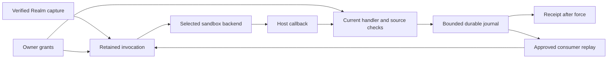

# Hosts retain Realm authority across sandbox execution

A host admits a captured Realm artifact and its requested capabilities before executing code.
The selected backend receives the program, bounded arguments and mediated callbacks. It does
not receive a World object, host filesystem path, credential store or provider token.

An author writing a captured realm in TypeScript starts from [TypeScript realms](TYPESCRIPT_REALMS.md),
which shows each declaration in `realm.ts` form and links back to the sections here.

## Admission

An invocation retains its World, Realm installation, artifact digest, approval revision and
handler. Every host effect checks that retained authority. Retries and nested calls preserve
it; a newer approval does not authorize an older invocation. Removing a grant blocks later
operations but cannot undo an effect that has already completed.

A source grant has its own revision. It remains stable across unrelated handler or consumer
approval changes, allowing self-consumption and cyclic pipelines. Removing and reapproving a
source, changing its artifact or reinstalling the Realm invalidates the old source reference.
The host allocates revisions; Realm declarations and guest arguments cannot assign them.


```mermaid
flowchart LR
    Capture[Verified Realm capture] --> Target[Retained invocation]
    Approval[Owner grants] --> Target
    Target --> Backend[Selected sandbox backend]
    Backend --> Callback[Host callback]
    Approval --> Check[Current handler and source checks]
    Callback --> Check
    Check --> Journal[Bounded durable journal]
    Journal --> Receipt[Receipt after force]
    Journal --> Replay[Approved consumer replay]
    Replay --> Target
```

## Data pipes

A channel is a general data pipe. Discord messages, webhook events, database change feeds
and Realm-produced events can supply it. A channel may be inbound, outbound or bidirectional;
a live conversational connection is one provider adapter.

`data-pipes.yml` version 1 declares sources and consumers:

```yaml
version: 1
sources:
  - name: changes
    stream: events
    type: note.changed
consumers:
  - name: archive
    handler: notes.store
```

Either list may be omitted. Source and consumer names are unique within their own lists.
A source supplies its name, partition stream and event type. A consumer supplies its name
and a captured `namespace.function` handler. Neither declaration supplies credentials or
selects an owner World. Consumer names identify independent cursors.

A Realm whose channels are generated carries four further declaration files, and a consumer
file is held to the same rules whether the host reads it at installation or at run time: a key
the host owns is refused at both, so is a handler the Realm never declared, and a conforming
consumer is accepted at both. A consumer file carrying a YAML tag or anchor is refused, and the
same file without them is read. `channels/<name>.yml` declares one channel: its transport,
endpoint, credential and handler. `sources/<name>.yml` names the channel a source draws its
events from. `consumers/<name>.yml` names the source and the handler, and says whether that
consumer speaks to the assistant, which is dispatched as declared. `credentials.yml` is a
non-empty list of declared credentials. A source name the Realm's `data-pipes.yml` already
claims is refused, and one unreadable file refuses its own scan without leaking its contents.

Source approval grants publication. Consumer approval grants access to one exact source
reference and requires separate handler approval. Host-source references bind a World,
provider registration, source revision and stream. Realm-source references bind a World,
Realm installation, artifact digest, source name, source-grant revision and stream.

A host must reject unknown declaration fields, duplicate names or keys, YAML aliases/tags,
malformed Unicode and scalar coercion. The governed reference implementation limits the
file to 64 KiB and each list to 128 entries. Source field values are nonblank, exclude control
characters and occupy at most 256 UTF-8 bytes.

## Publication

A captured handler uses `gateway.channel.publish`; Wasm handlers access it through
`ctx.gateway.channel.publish`:

```typescript
const receipt = await gateway.channel.publish({
  source: "changes",
  eventId: input.eventId,
  streamId: input.streamId,
  occurredAt: input.occurredAt,
  payload: { noteId: input.noteId },
});
```

All five fields are required. `occurredAt` is an ISO instant and `payload` is a JSON object.
The host derives the owner, installation, event type and partition from the retained target
and verified declaration. `streamId` identifies a logical event stream within that partition.
It does not select another source or World.

Publication returns `{receiptId, offset, replayed}` after the durable append. Keep the
producer identity, stream ID, event ID and payload stable on retry. A retry is the same event
when its source, event ID, stream ID and payload match, whatever its `occurredAt` says: it
returns the original receipt, and the first stored time stands. A different payload or stream
under the same event ID is refused. A receipt confirms acceptance, not completed downstream
effects.

The governed reference implementation accepts at most 64 KiB UTF-8 JSON with nesting depth
32 and string values up to 65,536 characters. It rejects extra fields, duplicate keys,
trailing JSON and invalid Unicode. This callback route requires a retained captured
invocation; the owner-authenticated and delegated-bearer ingress routes below append to the
same journal through their own authenticated identity instead, with no captured guest
invocation in the loop. There is no generic HTTP publication tool.

## Channels

A channel declaration names exactly one transport — a live socket, a polled endpoint, or an
inbound webhook — and the host refuses any other. It names the captured handler its frames are
delivered to, spelled as a namespaced verb, and that handler must be one the Realm's own
inventory declares. It names a credential the Realm also declares and never says where the
secret lives. Host-owned fields are refused in a declaration, as are unknown keys and keys
belonging to another transport. An outbound channel declares a reachable provider origin;
loopback and bare addresses refuse, only the scheme that transport speaks is accepted, and the
url may carry one credential placeholder in its path or query and nothing else in braces. One
file declares one channel name, the file is at most 64 KiB, and a symlink is refused however
good the file it points at.

The host attaches the bound credential, and a socket carries it on the upgrade; a polled
endpoint carries it on the request, or, where the declaration says the credential travels in
the path, exactly once in the path and in no header. A bearer credential goes out under the
declared scheme word, or under the usual one when none is declared. The api document has to
agree: its http security scheme is the declared word, or the usual one when none is declared,
and a document that spells another word is refused at install in either direction. A socket
channel may declare a handshake whose named reply field supplies the url it connects to; the
handshake goes out under the channel's own credential rather than the one serving the named
operation, and borrowing that operation does not borrow its approval. A reply missing the
declared field refuses rather than connecting somewhere unnamed, and a handshake url outside
the operator's allowed origins is refused. Redirects are never followed.

An inbound channel is served at an address the host mints at approval, and the address shown to
the owner is the one the host serves. A request is dispatched only after its declared signature
verifies against the bound secret; a body changed after signing is refused and a timestamp
outside the declared window is refused. An inbound channel may declare a verification reply,
which the host answers itself after the signature check, dispatching nothing — either echoing a
named field or returning a declared constant. A badly signed check is refused like any other
request, an ordinary event at such a channel is still dispatched, a verification reply is
refused on the outbound transports, and a constant answer over a kilobyte is refused at
declaration. The host's own authority headers never reach the guest, and the receipts answered
back are the publications the handler actually made.

A dispatch hands the guest the frame, the cursor the last dispatch left, and the headers the
transport carried; where there is no cursor yet and the transport carried no headers, neither
is handed over. Control frames reach the guest as an open and a close carrying the host's own
reason and nothing else, and every close reason is a tag from the host's own list. A keepalive
tick is its own kind of control frame, distinguishable from a real open, reaches the guest as
such, runs on its own declared schedule while the connection is open, and costs nothing against
the frame budget because the host authored all of it. Binary frames are dropped and counted,
never handed to a handler. A cursor the handler returns is kept along with the parameter name
it asked for and is sent on the next request under that name; a handler that threw leaves the
cursor where it was, and the cursor a handler is given is the one read before it ran. Each
installation and each channel keeps its own cursor, and a replacement is whole or not at all.

Reconnect backoff doubles from one second and stops at five minutes, jitter only shortens a
wait and never past the floor, and an operator's configured limits replace those defaults. A
provider close reconnects, and the reopened channel carries the cursor the last dispatch kept.
A socket handler may ask the host to end the connection: it ends after the handler in flight
returns, and the guest sees a close carrying the reason `guest` followed by a fresh open. That
request reaches only the channel's own live connection and refuses on anything else. A polled
endpoint may not poll faster than the operator's floor, whatever interval the Realm declared; a
429 or a 5xx dispatches nothing and waits out the backoff, while a 401 or a 403 closes the
channel with an error, tells the owner the status, and stops polling.

Budgets are per source per rolling minute, and two sources or two installations never spend
each other's. The six hundred and first frame in a minute is dropped and the cursor holds at
the six hundredth; each window costs the owner one visible problem and no more. An over-budget
frame never reaches the handler and never moves the cursor. A frame over the size limit is
dropped without spending a slot in the rate window, publications carry their own budget and
their own drop reason, and two sources or two installations never spend each other's budget. A
polled response past the frame cap is dropped rather than handed to a guest, and an inbound
body over the cap is refused before anything is looked up while a body at the cap is still
verified and dispatched. Repeated drops of one kind are counted every time but told to the
owner once.

Egress is bounded by the declared origin: a channel pointed at an origin the operator never
allowed refuses at start, before any connection. Guest-authored outbound bytes may carry the
credential placeholder, which the host substitutes on the way out, leaving the guest's own text
unchanged; an outbound frame holding the credential anywhere else is refused and never written,
including in an encoded form, and a cursor parameter name that spells the credential refuses
the request rather than sending it. Inbound content is scanned the same way: a provider
response that says the credential back is dropped whole rather than handed to a guest, encoded
forms included. Frame content is guest text and reaches no log line, including the content of a
refused request. The publications a dispatch reports are the host's own count, not the
handler's word for it, and a count the handler writes into its own result is not the reported
one.

## Credentials

A Realm declares the credentials it needs by purpose — kind, provider, description and docs
link — and never says what the secret is or where it lives. Five kinds are accepted and
anything else is refused. Only an authorization-flow credential carries scopes, and it names at
least one. A bearer credential may name the scheme word its token is sent under, and a scheme
the host would not put in a header is refused. Two entries may not claim one id, a docs link
the host would not show a person is refused, and a credential nothing in the Realm references
refuses the whole list.

The owner binds each declared credential: the owner's view is the list the Realm asked for,
showing nothing bound yet. A pasted secret is filed in the owner's wallet under a derived key,
and the grant holds only that key; an existing wallet item may be bound only when its shape
matches the declared kind; an authorization-flow credential is refused as not yet implemented
and names the follow-up. A binding survives a restart, and concurrent binds leave exactly one
winner with no orphaned secret. A pasted secret reaches the wallet and nowhere else, and a
failure after storage leaks it no further than a refusal does.

Nothing starts before binding: no transport is constructed while a credential is unbound, and
one is built once it is bound. Readiness names what is missing, a grant carrying no wallet key
is not a binding, each channel waits on its own credential and not another's, and a granted
source with a bound credential is ready. An unapproved source blocks the channel even when
every credential is bound.

Rebinding rotates: the running transport is stopped with a rotation reason and a fresh one
starts; the revision advances and the replaced secret is dropped. A rotation waits for the
frame already inside the handler before it dispatches the close, comes to rest, and a later
start reads whatever value the binding now names. An inbound channel rebinds only after the
request in flight is out, and a request signed with the credential the owner rebound away from
is refused.

Revocation closes and does not reopen: revoking the source closes the channel as revoked and no
later pass reopens it; revoking the installation closes its channels on the next reconcile;
revoking a credential drops the grant and the secret the host filed, and cannot be done twice.
A revocation arriving while a rotation is still draining is permanent, an inbound revoke
finishes the request in flight and refuses every one after it, and a channel with no credential
bound refuses every request.

The host, not the guest, puts the value on the wire: an outbound frame goes out with the
credential substituted while the guest's own text is unchanged, the host's own authority
headers never reach the guest, and an outbound request that would echo a path credential back
is refused rather than sent. The host reads whichever wallet item the grant names at the moment
it is needed, and a read that fails costs that attempt without putting anything it said into a
log. Where a declaration says the credential travels in a request path, the host substitutes it
at the declared placeholder and nowhere else; a url with no placeholder, or with two, refuses
rather than guessing; a url that already holds the credential refuses rather than sending it
twice; and a url whose decoding would spell the credential a second time out of one insertion
refuses. An outbound request that echoes the credential nowhere else is admitted, while an echo
in a header, in a header name, or in the body under any supported encoding is refused. The scan
has a documented depth and a documented limit, and a request that would spend the whole work
allowance is refused rather than admitted.

## The assistant call

A consumer may declare that it speaks to the owner's assistant, and the owner grants that one
consumer at a time. A consumer that never asked cannot be granted one, and the owner can see
and withdraw the grant from the same surface as the other approvals. A call from a consumer
with no grant is refused and no session is ever created, and so is a call from a sender the
owner has not paired. A refusal is returned to the guest as a code and never rides in an
exception message, so a Realm can answer with its own pairing hint. A call from a paired sender
returns the assistant's final message and nothing else; a session evicted mid-turn still
answers, and the next call gets a fresh one. Withdrawing the grant refuses the call in flight
and everything after it, while unpairing a sender lets the turn in flight finish and stops the
next one. What a sender wrote never reaches a log line, a meter or a span.

## Pairing

The owner mints a pairing code for a granted consumer; it has the pairing shape and is never
readable again. A consumer the owner has not let answer cannot be given a code, and a code
minted for one installation is not there to claim on another. Redeeming a code pairs the thread
it arrived on, persists the binding, and works exactly once. Minting again invalidates the code
the owner walked away from, a redemption that stalls until the code expires binds nothing, and
senders racing one code produce exactly one binding. Pairing does not advance the installation,
so a call holding the earlier revision still stands, and a sender pairing while the owner is
acting does not spoil the revision the owner holds. The owner sees the senders a consumer
answers and can stop answering one; unpairing a sender who is not paired is a conflict, not a
silent success; a pairing and an unpair colliding either both land or the loser is told so; and
an owner acting on an installation that has moved on is told so. Pairings survive a restart,
and the pairing endpoints are served under the versioned prefix, the declared path alone being
no surface at all.

## Polling positions

A captured poller reads its source cursor with `gateway.channel.position({source})`, which
returns `{position: string | null}`. It commits a page through `gateway.channel.publishBatch`:

```typescript
const { position } = await gateway.channel.position({ source: "changes" });
const receipt = await gateway.channel.publishBatch({
  source: "changes",
  batchId: page.id,
  expectedPosition: position,
  nextPosition: page.nextCursor,
  events: page.events,
});
```

Each event has `eventId`, `streamId`, `occurredAt` and object `payload`, with the same meaning
as single publication. All batch fields are required; only `expectedPosition` may be null.
The host appends the events and cursor change in one journal frame. A mismatched expected
position refuses the batch. An empty event list may advance the cursor. The receipt contains
`receiptId`, `offsets` and `replayed`.

Keep the batch ID, event identities, original timestamps, payloads and both positions stable
when retrying a page. An identical retry returns its original receipt; changed content under
the same batch ID is refused. A frame may already be durable when admission is revoked and
the response is refused. Admission is checked after force and before returning to the guest;
a retry still needs current authority. Receipt replay does not repeat the cursor update.

Position reads and batches require the current handler and same-installation source grant.
Requests cannot select an owner, World, installation or event type. A cursor belongs to the
logical source and its declared partition stream, not an event's `streamId`. Approving an
updated artifact preserves that logical cursor. A provider change or incompatible cursor
format needs a new source/stream identity or an explicit migration.

The reference host limits position requests to 8 KiB of UTF-8 JSON and batches to 1 MiB with
at most 256 events. Positions are nonblank opaque strings of at most 4 KiB UTF-8, without NUL.
A batch ID, event ID and stream ID are each nonblank, NUL-free and at most 256 UTF-8 bytes;
an occurrence timestamp is bounded to 128 bytes and an event payload to 256 KiB (4 KiB when
the event instead carries a gap marker). A duplicate event ID within the same batch refuses
it. Strict JSON parsing, journal payload limits and host/Realm storage caps also apply. These
callbacks work through Wasm and Docker. They support Realm-authored pollers using approved
schedules and API operations; automatic provider polling and webhook adapters remain separate.

## Replay

A consumer receives all seven fields by default — `offset`, `eventId`, `streamId`, `type`,
`occurredAt`, `gap` and `payload` — unless a [declared trigger](#me-captured-trigger-profile)
narrows the selection down to a subset of them. The envelope omits host paths, credentials
and authority selectors. Processing retains the source and consumer grants through host
callbacks and nested calls. A checkpoint advances only after the handler succeeds and
admission remains current. A host retains at most 1,024 sources, and at most 128 captured
consumers may bind to any one source; registration or delivery can refuse at these limits
even while the journal still has byte capacity to spare.

Delivery is at least once. A failed or interrupted handler keeps its durable offer for retry;
external effects need their own stable idempotency key. A completed Signal Bus handoff does
not confirm completion by every bus listener.

The reference implementation restores Realm source bindings on World load and rebuild.
After restart, replay begins when the owner World loads through startup warming or first
access. Provider connectors retain a separate approved lifecycle. Source discovery starts
no guest execution; the bounded replay scheduler performs delivery.

## Legacy event declarations

The reference host excludes live Realm `events/` files from runtime loading when captured
execution is selected. This covers scheduled polls, manual polls, webhook event projection
and declared-signal discovery, including a World previously loaded in compatibility mode.
The host checks the execution model before resolving live Realm directories.

Captured data-pipe publication and approved channel consumers keep their existing paths.
Generic captured polling and webhook event manifests remain unsupported. Explicit owner
webhook actions use a separate route. Declaration reads for authoring do not register a
source or grant execution.

## Capacity

Every Realm has finite host-enforced execution and storage limits. A dependency declaration
cannot increase them. Journal records, consumer control frames and recovery metadata count
against host storage policy. Exceeding a limit must refuse new writes without acknowledging
an uncommitted append or deleting unread records.

The reference journal defaults to 64 MiB shared across the host and 8 MiB of retained frame
bytes per World and Realm installation. A separate free-space check reserves 64 MiB. The
per-Realm charge spans all source names and streams. Reinstalling does not reclaim the old
installation's bytes from the shared limit.

By default, the reference journal reserves 25% of frame capacity for consumer control writes,
within both existing caps. The shared percentage applies after its metadata allowance.
Appends stop at the lower ceiling; adoption, offers and checkpoints may use the remaining
capacity. All frames consume append capacity. Hosts may configure 0–50%; zero disables the
reserve. Changing it affects new appends without rewriting existing data. A full total budget
can still block offers or checkpoints.

A record becomes eligible for reclamation once every adopted consumer of its source has
checkpointed past it; the reference host's automatic compaction only rewrites the log once
usage crosses a configured threshold (50% of frame capacity by default) and the rewrite
would shrink the log by a configured minimum (10% by default) — an eligible record can sit
unreclaimed for a while under those defaults, and automatic compaction also skips a rewrite
when the host's temporary scratch space is unavailable. An explicit compaction request
follows the same worthwhile-shrink check but, unlike the automatic path, refuses outright
when scratch space is short rather than skipping silently. A source with no consumer keeps
its records until capacity refuses new writes. Reclamation
never changes an offset, a source position, a consumer checkpoint, a pending offer or a
delegation, and a rewrite that fails at any step leaves either the previous log or the
complete replacement; it never acknowledges a lost record. A consumer adopted after
reclamation starts at the retained horizon, so replay of history is best-effort within
retained capacity. Reclamation needs bounded temporary space for the replacement within the
host's free-space reserve; without it the host refuses as full rather than rewriting.

Exact retries hold inside bounded windows after reclamation. The reference host defaults to
keeping the latest 256 batch receipts per source, configurable from 16 through 65,536, and
the identities of the last 256 reclaimed events, configurable from 0 through 65,536: inside those
windows a retry of the same event returns its receipt or the original offsets, even when it
carries a fresh `occurredAt`, and conflicting content is refused; outside them a retry is appended as a new event. This is the
at-least-once boundary between a host receipt and an external effect. A positioned batch
whose exact receipt is still within the retained window replays that receipt even when its
expected position no longer matches the source's current position; a positioned batch is
refused for a stale expected position only once its identity falls outside that window.

## Credentials and databases

Credentials remain in owner-scoped host storage. Guests refer to approved operations and
sources; they do not receive token values, wallet key names or a general credential lookup.
The host must constrain credential use to the approved destination and operation and keep
secrets out of guest results, error messages and logs. Ambient process environment variables
are not authority for a governed Realm.

External SQL belongs behind bound Virtual Cypher, approved producers or typed operations.
Use `params` for query values, including lists and nested objects. Raw `gateway.sql` access
is not a portable guest capability. Owner database setup selects a host-configured target
and its digest before storing credentials; target approval alone does not make it queryable.
Upgrade and revocation require the current installation and revision. Replacement approval
invalidates old access before removing its credentials. Revocation requires no database
connection and remains available when the configured target has been removed.

The legacy `token-env` spelling, which names a wallet entry directly on a captured API
operation, is deprecated in favour of a declared credential the owner binds, and an entry
migrated to a declared credential appears in the declared list alongside the native kinds. A
declared credential's id is read in either of the two spellings the wire carries, and an id the
host will not read a credential under is refused.

A private SQLite dependency serves the Realm's own computation or persistence. Its database,
WAL, snapshots and recovery overhead must fit that Realm's finite budget. It grants no access
to an external datasource. The host channel journal is a separate delivery facility.

## Captured API operations

A captured Realm may declare approved API operations in `apis/apis.yml` using vendored
OpenAPI documents. Each operation binds a fixed destination and a key from the owner's
wallet. In the governed profile, `token-env` identifies a wallet entry; it does not authorize
an environment-variable fallback. The guest supplies operation arguments, never credentials,
headers, server overrides or an alternative URL.

Owner preview shows the captured digest, installation revision, operation destination and
required wallet key name. Grant and revoke requests select the displayed installation and
revision. Granting an operation binds the current wallet value. Changing or deleting that
value prevents its use while the value is absent or differs from the approved value.
A different value requires approval. Restoring the identical approved value resumes access;
explicit operation or Realm revocation prevents that. Revocation remains available after
key deletion. These mutations advance the Realm installation revision, so
older retained invocations become stale.

The host checks the retained handler, consumer and operation grants and current credential
binding before network access and before returning data. API approval does not grant access
to another operation. Provider responses and errors must not expose the injected credential.
The provider itself is trusted with that credential: rejecting common echoes cannot prove
that a malicious provider has not transformed it into other response data. Revocation cannot
undo a request already accepted by the provider.

The reference profile supports:

| Declaration | Support |
| --- | --- |
| Specification | Vendored OpenAPI 3 JSON under `apis/`; no remote documents or external references. |
| Destination | One fixed HTTPS origin per API, port 443, validated public addresses and verified TLS hostname; no redirects. |
| Operations | Explicit GET operation IDs for reads, at most 128 per Realm; `post`/`put`/`patch`/`delete` operation IDs for writes under the [write-operation profile](#write-operations), each under its own grant. |
| Arguments | At most 64 scalar path/query parameters and 64 KiB JSON; a read operation takes no request body and no caller headers beyond the fixed set below. Each string argument is checked for a path-safe alphabet or a nonempty, control-free string as its location requires, capped at 2,048 characters; `body` is a reserved argument name a read operation cannot use; an integer is bounded to a signed 64-bit value and a number must be finite. |
| Validation | Types, required fields, enum and string-length limits; numeric ranges and regex annotations remain provider validation. |
| Authentication | API key in a query parameter or header, or HTTP bearer token; optional fixed `X-` headers. |
| Transport | The assembled request URI is bounded; a non-2xx provider status, unsupported content encoding, or a response exceeding the transport's own deadline all refuse the call — a small valid JSON payload alone does not guarantee acceptance. |
| Response | At most 1 MiB of strict UTF-8 JSON; common credential echoes and diagnostic exception text are refused. |

The initial implementation rejects unsupported auth schemes, parameter references, alternative
servers, a read operation carrying a mutation, and credential injection into HTTP
framing/control headers — the separate write-operation profile above is where a captured
Realm reaches `post`/`put`/`patch`/`delete` operations under their own grant. In captured
Worlds, live Realm API declarations do not create legacy tools or trigger credential
resolution. Approved operations are also available directly through the owner gateway and
its generated descriptors. An API-only Realm needs operation approval but no handler grant
or executable program. Previously discovered tools must refuse after an installation revision
change or revocation and while the wallet value differs from the approved value. Direct tools
retain the captured API contract even if source files change.

Captured API namespaces cannot shadow ordinary gateway tools or captured handlers. The
shared producer, enrichment, query-bound-operation and generic signal catalogs exclude
direct captured API tools until those callers carry retained authority. A legacy Realm
callback cannot use a direct owner tool to bypass its captured callback requirements.
Explicitly owner-authored World APIs keep their separate path. The API profile provides
neither a general credential lookup nor complete OpenAPI schema validation. Captured
handler producers can use the same approved API receiver. Graph-backed lens integration
remains open.

### Write operations

A captured `apis/apis.yml` entry may also declare `write-operation-ids`, naming OpenAPI
`post`, `put`, `patch` or `delete` operations with an optional JSON request body, alongside
its existing read `operation-ids`:

```yaml
write-operation-ids: [createReview]
```

A Realm declares at most 32 API entries. An entry's read `operation-ids` list must stay
nonempty even when it also declares writes, and at most 64 write ids are accepted per entry,
within the same 128-operations-per-Realm ceiling the read profile already enforces. A write id cannot also appear among the read
ids, and the write list is checked against the same vendored document, the same
destination, port and TLS rules as a read operation. A request body, when present, is
declared as an OpenAPI `requestBody` object holding only a `content` key — no `required` or
`description` alongside it — whose sole entry carries only `application/json` content, whose
own schema is either an inline object or a reference local to the vendored document's own
`#/components/`; the request body itself is bounded, at most 64 KiB.

The host refuses: a write id already listed as a read id, or vice versa; an unknown write
id; a `get` operation listed under `write-operation-ids`; a request body of any content
type other than `application/json`; a schema reference outside the document's own
components, including a reference to another server or document; and a destination,
redirect or authentication shape a read operation would also refuse.

A write operation now runs under its own owner grant, separate from the read grant for the
same key: approving a Realm's read operations does not approve any of its writes, and
revoking the write grant leaves reads untouched. Invoking an approved write sends the
request exactly once, carrying an idempotency key the host derives from the installation,
the operation and its arguments; the host never retries a write on its own. If the response
is lost once the request has gone out, the host refuses with a fixed message reporting the
effect as unknown, rather than guessing whether the destination received it. Revoking the
write grant between an owner's approval and the invocation that follows refuses the call.
The owner's approval view lists write operations distinctly from read operations, so
approving a Realm's reads is never mistaken for approving its writes.

The guest supplies the body under the operation argument named `body`. The host validates
it against the operation's own declared request schema — object shape, required
properties, the four scalar types, enum values and arrays — before it goes anywhere near
the network; an omitted or null `body` is accepted when the operation declares no request
schema, since a declared request body is not itself compulsory. This check is bounded
transitively by the 64 KiB argument cap above, since the body is a subset of that payload.

Pagination and an MCP transport remain a separate contract; GraphQL operations have their own
[captured GraphQL operation profile](#me-captured-graphql-operation-profile).

### Result admission

After a handler completes, the host rechecks its original retained target before returning
the result. Realm revocation, installation revision changes, lost consumer/source constraints
and interruption refuse a late result. The host does not replace stale authority with a
newer approval. Completed effects cannot be undone by this check.

## Backends and dependencies

The contract separates admission from backend selection. A host may implement Wasm, Docker
or another isolated backend while preserving retained identity, bounded I/O, mediated effects
and refusal behavior. A remote backend must preserve those checks and authenticate its
transport; backend placement does not grant access to credentials.

Captured Docker execution can load bundled CommonJS and JSON artifacts from
`dist/node_modules/`. The reference host verifies at most 256 runtime entries totaling 8 MiB
and resolves package main/index, subpaths, relative modules and cycles inside the container.
Missing imports have no host fallback. Package exports maps, ESM and native module loading
are unsupported. Bundled code receives no additional authority or credentials.

A Realm can declare exact package requirements in `dependencies/manifest.json`:

```json
{
  "version": 1,
  "runtime": "typescript",
  "dependencies": [
    { "ecosystem": "npm", "name": "formatters", "version": "1.2.3" }
  ]
}
```

The document is limited to 64 KiB and 128 unique ecosystem/name pairs. Nonempty
requirements need version 1. Unknown fields, duplicates, malformed values and version
ranges are refused. The optional runtime marker retains its existing language meaning.
An absent or empty dependency list requests no host packages.

The selected backend must admit every requirement before binding and execution. A backend
with no package support refuses nonempty requests. Requirements remain bound to captured
program content; editing source files does not change them. Declarations do not select a
sandbox, registry, command, path or credential.

The reference Docker adapter accepts bundled npm packages with matching name and exact
semantic version in `dist/node_modules/<name>/package.json`. Metadata is strict JSON with
a 64 KiB limit. The entrypoint must exist within the package, using supported CommonJS/JSON
file or index resolution. Exports maps, ESM and `gypfile: true` are refused; native modules
remain unsupported. These declarations check required root packages; they do not limit
imports from other modules already included in the same bounded capture.

No download, installation or registry resolution occurs. Libraries compiled into a Wasm
program remain part of that artifact; the reference Wasm backend supplies no host packages.
Other ecosystems, runtime provisioning and private database persistence remain open.
Unsupported storage requirements must be rejected before handler execution. No VFS syntax
is introduced here.

## Reference implementation

This governed implementation's current support is narrower than some trusted-host examples
in the main specification:

| Capability | State |
| --- | --- |
| Captured Wasm and Docker handlers, type methods and schedules | Retained approval checks. The bounded handler schema profile validates inputs before dispatch and outputs before final admission. |
| [Captured command aliases](README.md#commands) | Strict versioned metadata, owner discovery and direct chat dispatch to approved same-installation handlers. |
| Approved provider lifecycle and durable journal delivery | Implemented for Discord, Slack and Telegram. |
| Captured source/consumer approval and publication | Implemented with World-load source discovery. |
| Scheduled API-to-channel handlers | Captured schedules, approved GET operations, durable publication and consumer replay, including poller cursor persistence through `gateway.channel.position`/`publishBatch`. |
| Captured callback to an approved sibling | Implemented within the same installation. |
| Captured API operations and wallet bindings | Implemented for the read (GET) and write (`post`/`put`/`patch`/`delete`) profiles, each under its own grant. |
| Captured handler lenses | Versioned same-installation bindings; bounded JSON results, original-target refresh and prepared background runs. Completion and response checks retain admission; revocation clears stored data. Active work and settled storage are capped. Cache reuse is disabled. Opt-in content results hydrate owned focus under retained graph approval and select compatible built-in views; executable presentations are excluded. |
| Legacy Realm lenses | Excluded in captured Worlds, including previously loaded definitions and retained views. Owner lenses remain available; cached results are isolated by owner. Versioned handler bindings use the captured route. |
| Captured handler producers | Version-1 same-installation bindings, JSON batch keys and bounded record arrays. Owner precedence, retained World/approval checks, cancellation and call budgets apply. No result cache. `=`/`IN` filter pushdown through declared handler arguments; paging only through a declared cursor argument under a bounded page count, re-verified before every page. Reachable from a captured graph query along a declared join from a bound anchor; producers chain. Graph materialization preserves owner boundaries and host metadata. |
| Collection sources and mirrors | Captured complete-snapshot receiver with separate read/storage grants, atomic private records and coverage, authority-partitioned caches and finite capacity. Public declarations need matching host policy and never publish shared nodes. |
| Captured Virtual Cypher | Implemented owned reads and same-installation captured producers/collections with retained resource grants and rollback materialization. |
| Owner database target approval | Adoption, upgrade, revocation and read-only production SQL use through the owner connection facade are implemented. |
| Captured Docker CommonJS dependencies | Implemented for bounded, verified bundles; no runtime package installation. |
| Additional dependency ecosystems, private Realm database persistence and VFS | Not implemented on this path. |
| Firecracker, generalized remote backends and resumable arbitrary computation | Not implemented. |

Hosts must state which profile and capabilities they support. Generated types describe an
operation's contract; they do not grant permission or prove receiver availability.

## Me captured GraphQL operation profile

A captured Realm may declare `graphql/operations.yml` (version 1), naming one fixed HTTPS
endpoint and a fixed set of persisted query documents the Realm ships. There is no live
query text, fragment, operation name or endpoint override on the call path: every document,
its variable schema and the destination all come from the manifest, never from the caller:

```yaml
version: 1
name: catalog
endpoint: https://api.example.com/graphql
auth: bearer
token-env: catalog-token
operations:
  - name: productById
    document: "query($id: ID!) { product(id: $id) { name price } }"
    variables:
      - {name: id, type: string, required: true, max-length: 64}
```

The endpoint is a single fixed HTTPS origin pinned in the manifest: host present, no user
info, port 443 or the default, no query string, fragment, percent-encoded path segment or
`.`/`..` traversal segment, and no `{`/`}` placeholder that could turn it into a template —
reaching it follows the same no-redirect rule an ordinary captured API destination already
follows. Authentication is a bearer token or an API key in a named header, drawn from the
owner's wallet the same way an ordinary captured API operation's `token-env` is, plus up to
16 fixed `X-` headers. The source may name a credential the Realm declares with `credential:`,
alone or beside a `token-env:` naming the same secret. A query then sends the secret the owner
bound to that credential, and is refused while nothing is bound. At most 32 operations are declared per Realm, each with at most 32
variables; a variable is one of four scalar types — string, integer, number or boolean —
with an optional required flag, a length range for string-shaped values (default 0 to 2048,
capped at 2048), and an optional enumeration of up to 128 allowed values.

The manifest is read from the single fixed path `graphql/operations.yml`; no other file
name is recognized, and the file itself is capped at 64 KiB. Each persisted document is
checked once, at load time, against its own declared variables: it must be exactly one
`query` operation — never a `mutation`, `subscription`, or `__schema`/`__type`
introspection — with no fragments, no second top-level operation and no variable default
value, and its variable signature (name, GraphQL scalar type and required-ness) must match
the declared list exactly, with nothing extra and nothing missing. This check only
recognizes scalar-typed variables (`$name: Type`); a variable declared with a list type (for
example `$xs: [String!]`) does not parse as one of the four scalars, so the document is
refused at load time — a document is never left to run with an unmatched variable silently
dropped from validation. A call then supplies only a `variables` object; a declared optional
variable may be omitted or null. The host validates each supplied value's type, length and
enumeration against the declaration — each value capped at 8 KiB on its own, an integer
bounded to a signed 64-bit value and a number required to be finite — fills in the fixed
document text untouched, and refuses if the assembled request body would exceed 64 KiB. The
document text itself never varies per call and is never built from a guest-supplied
fragment.

The host accepts up to 16 fixed `X-` headers, each bounded to printable ASCII, and a bearer
`Authorization` header. The host refuses: an endpoint outside the fixed HTTPS shape above;
more than 16 fixed headers, or a fixed header outside that shape; an API-key header whose
name collides with a fixed header or with a small set of reserved authentication header
names; more than 32 operations per
Realm or 32 variables per operation; duplicate operation or variable names; a document over
16 KiB, not valid UTF-8, or carrying disallowed control characters; a document containing a
mutation, subscription, introspection field, fragment or variable default, or more than one
top-level operation; a document whose variable signature does not exactly match its
declaration; and a call that supplies anything besides `variables`, an unknown variable
name, a missing required non-optional variable, a value of the wrong scalar type, or a
value outside its declared length or enumeration bound.

The response is parsed as JSON. It is refused unless the parsed value is a JSON object
carrying a `data` member, and refused if that object carries an `errors` member — an
object with neither is refused rather than treated as an empty success. On success, only
the response's `data` member is returned, unwrapped — the rest of the response is
discarded. Typing that returned data beyond this, pagination and an MCP transport remain a
separate contract.

## Me captured graph-query profile


`ctx.gateway.cypher.query({cypher, params})` reads owned graph data and returns
`{rows, warnings, coverage}`. Pass values through `params`, as a JSON object or a JSON string.
The owner must approve `cypher_query` separately from the handler. List resources at
`GET /api/v1/realms/{realmName}/resource-approvals`; grant or revoke with
`POST /api/v1/realms/{realmName}/resource-approvals/cypher_query/{grant|revoke}` and
`{installationId, expectedRevision}`. Each change advances the installation revision.

Give every newly bound node a label and a name, and end the statement with a literal
`LIMIT` between 1 and 512. Every matched node must carry consistent ownership for the
caller. Shared-label exemptions, explicit sharing, anonymous or unlabelled nodes, named
paths, variable-length paths, collection construction, procedures and model-backed
functions are outside this profile. `params` cannot set `userId`, `worldId`,
`workspaceId` or any name starting with `__` — those stay host-derived. Supported
functions are a fixed set: `count`, `sum`, `avg`, `min`, `max`, `coalesce`, `size`,
`tolower`, `toupper`, `trim`, `tostring`, `tointeger`, `tofloat`, `toboolean`, `abs`,
`ceil`, `floor`, `round`, `date` and `datetime`; a call to any other function refuses.
Named host views, global source mirrors and diagnostic probes are not expanded or
invoked. Captured collections use the retained snapshot profile below.

Queries use the existing scoped Cypher executor and virtual join engine. Only
captured producers from the same installation can run. Their callbacks retain the
querying handler's admission and each API operation still needs its own approval.
Legacy SQL, model-backed producers and implicit identity enrichment are excluded.
Producer records have no shared query cache, and materialization is rolled back.

Requests are capped at 128 KiB, with 16 KiB statements and 128 parameters. The `rows`
array, at most 512 entries, is checked against a 1 MiB bound, and the host's outer 4 MiB
gateway response limit still applies. `warnings` carries the engine's warnings. `coverage` is
present and empty in this profile. A host that supports this profile limits a
query transaction to 15 seconds and buffers at most 4,096 rows or 4 MiB per statement.
These buffering limits apply after driver decoding; database memory limits remain deployment
configuration. Engines without bounded query execution refuse captured queries.

```typescript
const result = await ctx.gateway.cypher.query({
  cypher: "MATCH (b:Bill) WHERE b.status = $status RETURN b LIMIT 100",
  params: { status: "unpaid" },
});
```

A Docker handler makes the same call as `gateway.cypher.query`. A refusal rejects with one
fixed message, so the handler cannot learn which rule it broke. The rows come back as the
query projected them; return scalar properties (`b.id AS id`) when the handler needs plain
values.

A statement may cross into the Realm's own [captured producers](#me-captured-producer-paging-profile).
Each producer's join makes its target label reachable, and the host calls the producer's
handler as a nested call of the querying handler, so the producer runs only while that
handler's own grants hold. The ordinary Virtual Cypher rules apply: a producer's target label
must be reached along its declared join from a bound anchor, and a naked
`MATCH (i:Incident)` is refused. An anchor is bound by a pin or a predicate on a stored node
the owner holds. A producer's target may anchor another producer's join, so producers chain:

```typescript
// Service is stored; Incident and Postmortem come from two captured producers.
const result = await ctx.gateway.cypher.query({
  cypher: `MATCH (s:Service)-[:HAS_INCIDENT]->(i:Incident)-[:HAS_POSTMORTEM]->(p:Postmortem)
           WHERE s.team = $team AND i.impact IN ['critical', 'major']
           RETURN s.name AS service, i.incidentId AS incident, p.summary AS summary
           LIMIT 50`,
  params: { team: "payments" },
});
```

Fetched records are materialized for the statement and rolled back afterwards; nothing a
producer returns is kept in the graph.

### View references

A captured Realm may declare `queries/references.yml` (version 1), mapping a captured
alias to one of the owner's named views:

```yaml
version: 1
views:
  - {alias: recent, view: RecentPeople}
```

The file is capped at 8 KiB. At most 32 entries are allowed, each an `{alias, view}` pair;
`alias` uses `[a-z][a-z0-9_]{0,63}` and `view` uses `[A-Za-z][A-Za-z0-9_]{0,63}`, naming one
of the owner's own declared views. Aliases and view names are each unique within the file;
unknown fields refuse, and an absent file means no references. Each declared alias becomes
its own owner-approved resource, listed and granted or revoked the same way as the
graph-query resource itself, with a description naming the view it exposes.

A captured Cypher statement may name an approved alias as a node label. The host inlines
that alias's view body in its place, once, then validates the whole expanded statement
under the same bounds an ordinary query already meets — size, a terminal `LIMIT`,
parameters, and the function and procedure restrictions above.

The host refuses: a view body that itself references another view or alias, so nesting is
excluded; a materialized view; a view that takes parameters, since the guest cannot supply
them; a view whose current body cannot be inlined for reasons beyond those named exclusions;
and any alias without its own current grant — a revoked alias refuses the next query. An
approval does not guarantee the aliased view stays expandable; a view an owner later edits
into an unsupported shape refuses at the next query even though the alias grant itself is
unchanged. Naming the owner's view by its real name, rather than the alias, never returns
the alias's data. Identity bridges, resolve chains, node-view composition and lens
combinations remain unsupported.

## Me captured goal profile

A captured Realm may declare planner goals under `goals/` as version-1 data:

```yaml
version: 1
goal: summarize-notes
handler: notes.summarize
input: NoteRequest
output: NoteSummary
description: Summarize the owner's notes
```

`goal` uses `[a-z][a-z0-9-]{0,63}`. `handler` names a captured `namespace.function` of the
same installation. `input` and `output` are simple type names resolved against the whole
World's declared types, not only ones the declaring Realm itself supplies — the handler
locality check above is the binding restriction, and type names carry no equivalent
per-Realm restriction of their own. `input` may also be `UserInput`, the host's request
type, delivered to the handler as `{"content": text}`. `description` is optional, at most
512 characters. Names with package or path separators, any other field, and legacy owner
goal shapes are refused. A Realm's goal declarations count against the same limits as
commands: 32 flat YAML files, 8 KiB per file, 64 KiB combined.

The host deploys each current goal as one handler-backed planner action plus one exported
goal named `<goal>_goal`, callable from chat as a goal tool. The action passes the input's
fields to the handler as one JSON object and binds the handler's object result as the
output type; the handler's input and output schemas apply. Every selection and run retains
the owner, World, installation revision, capture digest and handler approval, rechecked
before dispatch, on host callbacks and before the result is released. Binding the output
also walks the output type's own ancestry, each parent once; a handler that otherwise
succeeds still leaves the output unbound if that walk exceeds 64 distinct labels. A refused
or failed run, or an output that fails to bind this way, is reported to the conversation
and leaves the output unbound; the process is not aborted. Goals that name undeclared types, reuse an owner action or goal name, or duplicate
another Realm's goal are excluded with a loading problem. The owner may switch a goal off by
name. Owner-authored planner steps keep their own trust boundary and are the way a chat
request becomes a Realm input type; Realm `actions/` are not loaded.

## Me captured trigger profile

A captured Realm may declare trigger bindings under `triggers/` as version-1 data. A
trigger binds one declared channel source to one declared consumer with an explicit
delivery mode and a bounded selection of the event fields the consumer receives:

```yaml
version: 1
trigger: on-change
source: changes
consumer: apply-change
mode: observe
input: [eventId, payload]
description: React to a changed note
```

`trigger` uses `[a-z][a-z0-9-]{0,63}`. `source` and `consumer` name declarations in the
Realm's own `data-pipes.yml`; a trigger is exposed only when both exist there, for the same
installation the trigger was captured with. `mode` is exactly `observe` or `apply`. `input`,
when present, is a subset of the seven fields a consumer receives — `offset`, `eventId`,
`streamId`, `type`, `occurredAt`, `gap`, `payload` — with no duplicates; an absent `input`
carries all seven. `description` is optional, at most 512 characters. A Realm's trigger
declarations count against the same limits as its other flat manifests: 32 files, 8 KiB per
file, 64 KiB combined.

Unknown fields, an unrecognized `mode`, a duplicate `input` entry, a field outside the
seven, an uppercase or path-shaped `trigger` name, and any legacy handler-style field all
refuse without reflecting the offending value. A trigger naming a source or consumer the
Realm has not declared, a foreign owner or World, and a stale capture digest all refuse the
same way.

Loading trigger bindings now feeds real delivery. A bound trigger narrows what its consumer
receives to exactly the fields `input` names (all seven when absent); the handler never sees
more of the record than that selection carries. A consumer with no matching trigger is
unaffected — a trigger only narrows what the untriggered wiring would already deliver, never
widens it.

That guarantee assumes the installation's trigger manifest resolves cleanly. Today, a
manifest with even one trigger naming a source, consumer or handler that does not exist fails
to resolve at all, and delivery stops for every consumer of that installation — not just the
consumer the bad trigger names, and regardless of whether the affected consumer is bound to a
Realm-declared source or a host-provided one such as Discord, Slack or Telegram — until the
manifest is corrected. A source with no declared name of its own, like those host-provided
channels, matches a trigger by consumer name alone; if more than one declared trigger matches
the same consumer this way, that is itself refused as ambiguous, even when the triggers'
own names differ.

In `observe` mode the handler receives its narrowed record and runs with every host call that
would publish an event (`gateway.channel.publish`, `gateway.channel.publishBatch`), propose
a write (`write_propose`), or invoke any approved write-effect API operation refused for the
whole invocation — an otherwise-approved API write is refused the same as an unapproved one.
Reads stay available. That refusal is fixed on the
retained target at bind time, so it reaches everything the handler goes on to start as well —
a query that fetches a producer, or a sibling handler reached through the host — not just the
handler's own frame. The handler's own returned result is discarded by the delivery path
today rather than recorded. `apply` mode has no destination policy yet, so the host refuses
it at bind time, before any event ever reaches the handler.

None of this changes the durability contract every consumer already has: delivery stays at
least once, so a duplicate or replayed event is not filtered out here, and a binding revoked
before its record is delivered is refused and left for retry rather than silently dropped.
The offer stays durable — none of this promises the handler's own effects ran exactly once.

Pending: diagnostics that name which dependency a trigger was refused for — missing source,
consumer or handler wiring, versus a stale capture digest — are not yet specified beyond that
shared refusal. Any reply path a trigger might carry also remains a separate later contract.

## Me captured write proposal profile

A captured handler may build a typed, bounded write proposal describing an intended graph
write before any confirmation. A proposal is one of two kinds: a `method-write-back`, which
names a method to call, or a `decoration`, which sets fields directly:

```json
{"version":1,"kind":"method-write-back","target":{"label":"Note","key":"n1"},
 "method":"archive","fields":{"archived":true},"expectedRevision":3,
 "effect":"private-storage"}
```

`target.label` names a label the operator has opened to proposals (see the owner decision
below). Declaring the type in the Realm is neither needed nor enough: a label outside the
operator's list is refused however the Realm declares it. `target.key` is text, at most 2048 bytes. `method` is required for a `method-write-back` proposal and refused for a
`decoration`. `fields` is a nonempty map; the 64-entry limit and the 4-level nesting bound
apply to every nested object or array in the tree, not only the top level, so a guest
cannot dodge the entry cap by nesting extra keys one level down. A key reserved for host
identity or bookkeeping — `userId`, `worldId`, `workspaceId`, `visibleTo`, `owner`,
`ownerId`, `labels`, or any key beginning with an underscore — refuses the whole proposal
wherever in the tree it appears. An integer outside the signed 64-bit range, or a
non-finite decimal, also refuses. `expectedRevision`, when present, is a non-negative whole
number. `effect` is exactly `private-storage` or `external`, naming where the write is
understood to land.

The host refuses: the whole document over 65,536 bytes or carrying duplicate keys; an
unknown top-level field; a malformed target; `fields` absent, empty, over the entry or
depth limit, or holding a reserved key; a negative or fractional `expectedRevision`; and an
`effect` outside the two named values. No refusal reflects the value that triggered it.

A Wasm handler submits a proposal with `ctx.writePropose(proposal)`, which is the
`write_propose` host call under a fixed name. It resolves to `{proposalId}` once the proposal
is filed, and a refusal rejects with one fixed message that names nothing. The handler never
learns how, or whether, the owner decides:

```typescript
export async function archiveNote(input, ctx) {
  const { proposalId } = await ctx.writePropose({
    version: 1,
    kind: "method-write-back",
    target: { label: "Note", key: input.noteId },
    method: "archive",
    fields: { archived: true },
    effect: "private-storage",
  });
  return { proposalId };
}
```

Before filing, the host checks that the owner has approved write proposals for this
installation and that the target is exactly one private record the calling handler's own
owner already holds under that label and key. A proposal for a record the owner does not
have, or one that someone else can see, is refused. Each installation holds at most 32
pending proposals at once; a submission beyond that cap is refused. Pending proposals live
in host memory, so a restart discards them. Revoking or upgrading the installation makes its
pending proposals unusable; they are cleared the next time that installation submits or the
owner lists them. Submitting needs its own approval, distinct from `cypher_query`: the owner
grants it through the same admission preview, adopt and upgrade flow as other resources, and
it is listed separately from graph-query approval, so approving a Realm's reads never also
approves its write proposals. A trigger in `observe` mode refuses `write_propose` for the
whole invocation.

### The owner decision

Nothing is written until the owner accepts. The owner lists a Realm's pending proposals and
decides each one:

```http
GET /api/v1/realms/{realmName}/proposals
POST /api/v1/realms/{realmName}/proposals/{proposalId}/decision
Content-Type: application/json

{"decision":"accept"}
```

The list is a JSON array of `{proposalId, kind, target, method, fields, effect,
expectedRevision}`. The decision body is exactly `{"decision":"accept"}` or
`{"decision":"reject"}`, at most 256 bytes, with no query string. A decision takes the
proposal out of the list whatever its outcome, so each proposal is decided once. The answer
is `{"outcome": ...}`:

| Outcome | Status | Meaning |
| --- | --- | --- |
| `APPLIED` | 200 | The write committed. |
| `REJECTED` | 200 | The owner said no. Nothing was written. |
| `REFUSED` | 400 | The proposal fails its checks at decision time: the installation was revoked or moved to a new revision, the approval was withdrawn, or the operator's policy does not allow this write. |
| `CONFLICT` | 409 | The proposal is not pending (already decided or unknown), or `expectedRevision` does not match the record's current revision. |
| `UNKNOWN` | 503 | The host cannot say whether the write landed. Read the record before proposing again. |

The operator decides what an accepted proposal may do, and a Realm cannot add to it. For
each label the operator opens, it names the property that identifies a record, optionally a
revision property, the properties a `decoration` may set, and the methods a
`method-write-back` may call. A method maps each of its argument names to the property the
value lands on, and a proposal must supply exactly those arguments. On accept the host also
requires:

- `effect: "private-storage"`. An `external` proposal is filed and shown, and accepting it is
  refused.
- flat `fields`: each value a string of at most 8 KiB, a number, a boolean or null. Nested
  objects and arrays pass submission and are refused on accept.
- an `expectedRevision` only where the operator named a revision property. When it did, the
  proposal's revision must equal the record's, and an applied write moves the record's
  revision on by one.
- the record is still exactly one private record of the owner's, checked again under a lock
  inside the write.

Authority is checked before the write, inside it and just before it commits. A revoke that
lands mid-write rolls the whole write back. An applied write leaves a private receipt
recording the proposal, the installation and the kind of write, and changes nothing else.

## Me captured producer paging profile

A captured producer may declare a paging profile alongside its key argument:

```yaml
page:
  argument: cursor
  maxPages: 4
```

`argument` matches `[a-z][A-Za-z0-9]{0,63}` (so `nextCursor` is accepted and `next_cursor` is
refused) and must differ from the producer's own key argument. `maxPages` is a whole number
from 1 to 16. If the handler's own input schema closes its properties (an explicit
`additionalProperties: false`) without listing the page argument among them, the whole
declaration is refused at bind time rather than left to fail opaquely on the second page. On
the first call the host omits the page argument; on each later call it passes the cursor the
handler returned. The handler answers with an object holding exactly `rows` and `next` — a
next cursor, or a null `next` to stop; the host repeats the call until the handler stops or
the declared page cap is reached, and the rows gathered across the whole fetch stay within
the same cap an unpaged fetch already enforces, checked cumulatively page over page. A
producer with no `page` declaration behaves exactly as it did before this profile existed.

The host refuses: a page argument equal to the key argument; a `maxPages` outside 1–16; a
result that is not an object holding exactly `rows` and `next`; a next cursor that is not
text or null, is empty, or carries a control character or invalid Unicode; a next cursor over
2048 bytes; a next cursor repeating one already seen in the same fetch; a non-null next cursor
on the final permitted page; more pages than declared; and a cumulative row count or byte total
over the cap — never a silently truncated result.
Authority is rechecked before every page and after the last; a revocation partway through
refuses the whole fetch, never a partial one.

## Me captured producer pushdown profile

A captured producer may name query filters its handler applies itself:

```yaml
pushdown:
  - property: verdict
    argument: verdict
```

When a query pins `property` on the producer's target label with `=` or `IN`, the handler
receives `argument` as a list of the string values the query allows, next to the key
argument. `m.verdict = 'blunder'` arrives as `"verdict": ["blunder"]`, and
`m.verdict IN ['mistake', 'blunder']` as `"verdict": ["mistake", "blunder"]`. Two filters on
the same property pass only the values both allow, which can be an empty list. A property the
query does not filter on, or filters another way (`>`, `CONTAINS`, a function over the value),
passes nothing, and the handler receives the argument only when there is something to pass.

Pushdown changes what the handler fetches, never what the query returns: the graph applies
every filter to the returned rows again. A handler that ignores the argument returns the same
answer after fetching more.

`property` is an identifier and `argument` matches `[a-z][A-Za-z0-9]{0,63}`. A producer declares
at most 16 rules. The host refuses an argument equal to the key argument or the page argument,
the same argument named twice, and, at bind time, an argument the handler's input schema closes
out with `additionalProperties: false`. With paging declared, the pushed arguments go with every
page. The query diagnostics name the pushed arguments on each call.

SQL, vector, generative and aggregate producer profiles and partition changes remain a
separate contract.

## Authenticated source ingress

An authenticated owner can append an external event to an approved captured source:

```http
POST /api/v1/channels/sources/{realmName}/{sourceName}/events
Content-Type: application/json
```

```json
{"installationId":"<approved installation>","sourceRevision":1,"event":{"eventId":"provider-event-42","streamId":"room-7","occurredAt":"2026-09-09T00:00:00Z","payload":{"text":"hello"}}}
```

Read installation and source revision from the source approval endpoint. Source revisions
survive unrelated handler approval changes; revoking and granting the source creates a new
revision. The owner and selected World come from authentication, and the stream and event
type come from the verified declaration. Payload fields cannot override that authority.
The request is strict JSON, at most 64 KiB, with the journal's existing event limits.

HTTP 200 returns `{receiptId, offset, replayed}` after durable append. Retry the same event
ID, stream and payload after an uncertain response; a restart returns the same receipt. A
retry stamped with a later `occurredAt` is still the same event and keeps the first time.
Changed payload or stream for an existing event ID returns 409. Capacity returns 429 and storage failure 503.
Admission is checked again during the write. Acknowledgment confirms storage, not successful
consumer execution. World load restores approved source bindings and replays pending offers.

This route uses the host's owner authentication. It does not mint an ingress-only token or
verify provider-specific webhook signatures. Providers that require their own signature or
reply protocol need a host adapter. Source IDs and payload fields are not credentials.

### Legacy executable migration

Me does not load Realm `actions/`, `goals/` or `mcp/` files as host StepSpecs or
subprocess registrations. Owner configuration retains those host features. Compile
Realm code into captured manifest handlers and bind commands, function schedules,
producer handlers, lenses, data-pipe consumers or captured goals. A legacy
`stepType: goal` file inside a captured Realm is reported and never parsed; declare
goals with the [captured goal profile](#me-captured-goal-profile) instead. MCP/GraphQL
transports require dedicated profiles; host declarations do not grant those capabilities.

## Approved SQL callers

Production SQL reads and introspection go through one owner-scoped connection path. It
resolves the current authenticated owner and selected World, then retains the exact datasource
approval, configured PostgreSQL target digest and scoped wallet credential. A legacy datasource YAML
entry cannot choose a production connection or credential. Discovery lists current owner
approvals. There is no environment or generic wallet-key fallback on this connection path.

Connections use the configured certificate policy and driver timeouts. Reads run in a
read-only transaction with 15-second statement and three-second lock limits, then roll back.
The receiver rechecks owner/World, approval and credential before use and after projection.
The facade accepts a single SELECT and binds values with prepared statements. Results are
limited to 1,024 rows, 128 columns and 1 MiB of encoded row data; overflow is unavailable rather than a partial
success. These limits apply after driver value decoding. Database permissions and server
memory limits remain deployment policy.

The current approval profile is read-only. Updates and stored procedures are unavailable,
and writable procedure tools are not exposed. Reads, metadata discovery and learning require
an authenticated owner context; a supplied user ID alone is insufficient. Connection failures
return fixed messages without JDBC URLs, driver errors or credentials.

Migrate old owner datasource files by selecting and approving a configured target through
Connect, then reference its target ID in Virtual Cypher producers or typed operations.
Raw SQL remains excluded from captured guest operations. Private SQLite remains a separate
bounded dependency use case. Production has no legacy connection fallback.

## Captured browser apps

A browser app needs its own explicit approval for an exact captured entry point. Handler
approval alone does not approve an app. Its HTML and handler allowlist belong to the same
World, installation and digest as that approval.

The reference browser profile accepts `apps/<name>.html` (or `.htm`) with a matching
`apps/<name>.html.app.json` declaration:

```json
{"version":1,"handlers":["notes.list"]}
```

`version`, `handlers` and the optional `resources` field described below are the only
fields accepted. Handler names are unique and must appear in the same captured handler
manifest. An empty `handlers` list is allowed, for a page that calls nothing back. The
reference host allows 32 apps per capture, 32 handlers per app and 8 KiB per declaration.
Unknown fields, duplicate JSON keys and unsupported versions are refused.

Everything an app needs travels inside the page, because the frame has no network. An app
that carries its own engine, fonts or data set needs room for it, so the size limits are the
operator's to set. The defaults are:

| Limit | Default |
| --- | --- |
| The HTML entry point | 10 MiB |
| Declared resources per app | 16 |
| Any one resource | 10 MiB |
| All of an app's resources together | 10 MiB |

An app over any of these is refused when it is opened. The host does not trim it to fit. Check
the host's published limits before shipping an app near the defaults.

The browser receives a `realm.call(handler, arguments)` function. It returns a promise for
the handler's JSON result, or rejects when the operation is refused or unavailable. Arguments
must be a JSON object and default to `{}`. The selected handler must be declared by the app
and independently approved. Its API, query and channel capabilities retain their separate
grants. A request cannot select an owner, World, capture or installation through its
arguments.

One call runs at a time. A second `realm.call` made while the first is still waiting
rejects straight away with "A Realm call is already running", so an app that fires several
reads chains them (`await` one before starting the next). A call gives up after about two
minutes. Every refusal, whatever its cause, rejects with the same message, "Realm call
refused or unavailable", so an app cannot tell a revoked grant from a failed handler and
should show one plain error for both. The encoded request is capped at 1 MiB and the handler
name at 256 characters.

```html
<script>
  async function load() {
    try {
      const notes = await realm.call("notes.list", { limit: 20 });
      const tags = await realm.call("notes.tags"); // after the first one settles
      render(notes, tags);
    } catch (e) {
      showError("Could not load your notes.");
    }
  }
  load();
</script>
```

Realm HTML runs in a frame sandboxed to scripts only, with an opaque origin. It cannot read
the owner page's storage, cookies or DOM, call arbitrary owner APIs, open popups, navigate
the top page or submit forms. The page's content policy blocks every network request
(`fetch`, `XMLHttpRequest`, WebSocket, remote scripts, styles, images and fonts). Scripts
may be inline and may use `eval`, so an app can carry a bundled engine. Images and fonts
work only as `data:` or `blob:` URLs. Bundle external code and styles during authoring. If
the app reloads or navigates its own frame, the bridge stops answering until the owner
reopens the app. Realm JavaScript and templates cannot be imported into owner-origin pages through
app-serving URLs. Owner-authored workspace apps and trusted World-template apps retain
the host's owner app runtime.

The host mediates calls through a document-bound message channel and a retained session.
App and handler approval, installation revision and expiry remain attached to nested calls,
host callbacks and final result release. Revocation or any installation revision change
invalidates the session. Every page load opens a session. The reference host permits one
active call, up to 256 calls and a 15-minute lifetime per session, with at most 256 sessions
per host. An owner holds at most 16; opening a 17th ends that owner's oldest session, so a
reload never locks the owner out, and the page that lost its session sees its next call
refused. Restart discards sessions. Opening a new session requires current approval. The bridge does not retry
effects automatically; a refused response cannot undo an effect that already completed.

In the reference owner API, `GET /api/v1/realm-browser/{realm}/approvals` lists the current
installation, revision, digest, app names, declared handlers and approval state.
`POST /api/v1/realm-browser/{realm}/approvals/{name}/grant` and `/revoke` take exactly
`installationId` and `expectedRevision`. A stale revision returns 409. Open an approved app
at `/apps/{realm}/{name}`. Existing flat links retain name-resolution precedence.

### Declared resources

A captured browser app may also declare stylesheet and script resources drawn from its own
asset directory, alongside its existing handler allowlist:

```json
{"version":1,"handlers":["notes.list"],"resources":["apps/notes.html.assets/app.css"]}
```

Each resource path has the shape `apps/<the entry point's own filename, extension
included>.assets/<file>.css` or `.js` — an entry point saved as `notes.htm` takes resources
from `apps/notes.htm.assets/`, not `apps/notes.html.assets/`. The count and size limits are
the operator's, with the defaults in the table above. A path listed twice is refused. The
host inlines every declared stylesheet inside its own `<style>` block and every script inside
its own `<script>` block, in declaration order, ahead of the app's HTML and inside the same
sandboxed guest document described above. An app that declares no resources is served as
its HTML alone.

Both the entry point's own filename and each resource's own file name are bounded basenames
— up to 120 characters of letters, digits, `_`, `.` and `-` before the extension, the first
of them a letter or digit — not arbitrary text; a name outside that shape refuses. The host refuses: a path outside the
declaring app's own asset directory — another app's directory, `..`, an absolute path, a
URL, or an extension other than `.css`/`.js`; more resources, or a larger resource, than
the count and size limits allow; and a resource whose
text contains the closing tag of its own wrapper — `</style` or `</script`, in any letter
case — refused when the resource is read, never escaped into the page. A resource's own
content is otherwise inlined verbatim; it carries no separate sandbox or origin of its own,
since it becomes part of the same guest document that requested it.

Image and font files, resources drawn from another origin, component imports and the
owner's own app runtime remain outside this profile. Embed an image or font as a `data:` URL
inside a stylesheet or script instead.

## Delegated source ingress

A host may issue an append-only bearer credential for one approved captured source. The
credential MUST retain the owner World, installation identity, capture digest and exact
source revision. Possession authorizes only source append, never owner authentication,
approval changes, reads or unrelated routes. Source removal/reapproval, capture change and
reinstall invalidate the old binding. Unrelated approval changes may preserve source
revision. Provider webhook signatures require a separate profile.

Only a cryptographic verifier of a high-entropy secret may persist. The host returns the
secret once at issue/rotation and does not expose it in metadata listings. Credentials
travel in the Authorization header, not event payloads or query parameters. Carrying that
header over a secure transport is a deployment responsibility; the receiver itself checks
bearer syntax and request shape and does not require or verify TLS on this route. The host
derives attribution and limits independently of untrusted event data.

Append MUST commit event, attribution, receipt and quota consumption atomically. A
response-loss retry of the same event returns the same receipt without spending quota again,
and a fresh `occurredAt` on the retry does not make it a new event. Rotation MUST
invalidate the old verifier while preserving delegation identity, expiry, quota and retry
identity. Expiry and revocation deny new appends and receipt replay; a recorded event does
not restore authority. A different delegation cannot reuse another submitter's event ID to
claim its receipt. Consumers require their own current source/consumer admission.

### Me delegated-ingress profile

Owner endpoints are `/api/v1/channels/sources/{realmName}/{sourceName}/delegations` (GET
metadata, POST issue), with `/{id}/rotate` and `/{id}/revoke` POST operations. These owner
mutation request bodies are capped at 8,192 bytes. Issue fields are exactly `installationId`,
`sourceRevision`, `label`, `expiresInSeconds`, `maxEvents`, with `label` nonblank, free of
control characters and at most 128 UTF-8 bytes. Rotation/revocation require exactly
`installationId`, `sourceRevision`, `expectedGeneration`. Issue and rotation return
`{delegation, token}` with no-store caching; metadata includes ID, label, expiry, quota,
accepted-event count, generation and revocation status.

`POST /api/v1/channel-ingress/delegated/{id}/events` accepts the bearer and exactly
`eventId`, `streamId`, `occurredAt`, `payload`, with an event body capped at 64 KiB; this
route refuses any request that carries a query string at all, not only one carrying
credentials — `?trace=1` on an otherwise valid request refuses the same way a query-string
bearer token would. The receiver supplies declared event type and
host attribution. It returns `{receiptId, offset, replayed}` after durable storage. Quota
exhaustion returns 429; changed event content or conflicting generation returns 409. Failed
authority or storage checks return refusal, never an unverified success receipt. A response
refusal can follow a completed append if authority changes during durable IO.

The secret contains 256 random bits; the private journal stores a SHA-256 verifier. The
profile allows a lifetime of one second through 30 days, up to
10,000 accepted events, one event/request of at most 64 KiB, 32 indexed delegations/source,
4,096/host and 32 concurrent token requests/service. Rotation does not renew expiry or quota.
Expired/revoked indexes can be pruned at issuance; historical frames remain charged to the
journal's finite byte budget. New grants, rotation and append use data capacity, preserving
control reserve for revocation. Legacy records without attribution remain readable.


## Captured collection snapshots

A host may support version-1 `sources.yml` containing at most 16 sources in 64 KiB.
Each entry binds `name`, `producer`, `label`, `identityProperty`, `partitionProperty`,
`visibility`, `sync` and `completeness` to verified capture bytes. The producer must be
a captured same-installation handler binding whose joins target that label and partition
field. The identity must agree with the captured query type identity. Supported sync is
`{strategy: mirror, refresh: full_rewalk, trigger: on_first_use}`; completeness is exactly
`{declaredTotal: '$.total', aggregatesRequireComplete: true}`. Unknown fields and policies
are refused. Organization sources and explicit anchors are outside this profile.

The owner separately approves `cypher_query`, `source.read.<name>` and
`source.mirror.<name>` through the resource approval API, in addition to both querying
and producer handlers and any API operations. Every acquisition, read, refresh, write,
coverage read and final result retains owner, World, installation, capture digest,
revision, producer and source/storage grants. Revocation or changed retained authority
refuses warm reads as well as new acquisition. A public declaration additionally needs
an exact host-configured public source policy for its producer, label, identity,
partition, sync and completeness. It does not authorize shared publication. Existing
host public-dataset publication remains a separate explicit host decision.

An unpaged producer receives one partition key and returns `{records,total}` itself; the
total must match the distinct record count, and a missing total refuses before persistence.
A producer that instead declares the paging profile above returns `{rows,next}` per page as
usual, and the host synthesizes `{records,total}` from the gathered pages, with `total` set
to the row count it collected — the producer never supplies a declared total of its own on
this path. Either way, partial results, duplicate IDs, wrong partitions and reserved
ownership/sharing/internal properties refuse before persistence. Collection source names,
producer names and labels must each be unique across the manifest; two differently named
sources sharing one label refuses the whole manifest at load.
Empty complete partitions use an empty array and total zero. Each snapshot is at most
512 rows / 1 MiB; each row has at most 64 scalar properties, and text values are at most
65,536 characters. Identity and partition strings are bounded. A query fetch accepts
at most 16 partition keys and 1,024 rows; a result includes at most 64 coverage entries.
Only complete snapshots may reach query materialization or aggregate evaluation.

Records and measured coverage are one atomically committed, privately addressed value.
The address includes the entire retained authority, source and partition. It cannot be
selected by guest-supplied owner or storage identifiers. No private cache node is visible
to ordinary guest queries, and no source row merges into preexisting application nodes.
Queries materialize owner- and run-specific virtual nodes and roll them back, including
when a foreign, public or unowned node shares a record ID. The returned `coverage` list
contains source, partition, held count, declared total, `COMPLETE` status and acquisition
time. Global source registries supply no snapshot records or measured coverage of their own to
this receiver, but the host's global public-source policy is still consulted when checking
a public declaration, since that policy is where the exact producer, label, identity,
partition, sync and completeness match against a public declaration is defined.

A host supporting this profile permits 16 concurrent acquisitions, 32 retained partitions
per source revision and 256 partitions / 16 MiB of record payload per host. It refuses
competing or recursive acquisition of the same partition. Snapshots expire after 15
minutes; callers can request full refresh of accessed sources with
`refreshSources: ["source-name"]` on `cypher_query`. Writes reclaim expired entries and
superseded revisions of that installation/source. Otherwise a full store refuses.
These limits cover retained application payload and finite metadata; graph-engine logs
and physical overhead are host infrastructure concerns. Graph operations have a 15-second
server deadline. Hosts unable to provide bounded atomic storage refuse this profile rather
than falling back to the legacy shared mirror writer.

The Docker adapter permits two active invocations per installation within the configured
global container cap (default four), allowing a querying handler to call its captured
producer. Further nesting and exhausted global capacity refuse immediately. Container teardown
always releases its capacity reservation and invocation slot once removal has been asked
for and waited on, whether or not that removal could be confirmed; an unconfirmed
container is not held to protect anything, since no invocation slot is kept for it either
way. The isolation profile is unchanged.

## Observability

A host tracks every dispatch and every host call it accepts on a Realm's behalf after it
passes the host's up-front shape and size validation, along with every admission decision it
makes about one, and an operator can see that activity as
metrics, trace spans and log lines. What the host records about one of those crossings is
identifiers and outcomes: who owns the Realm, which World and installation it is installed
in, which Realm and handler ran, a per-call identifier, whether the crossing succeeded,
failed or was refused, how long it took, and, for a dispatch, how many bytes crossed in
each direction. The content of what ran is not part of that record: no argument value, no
result value, no script and no message a Realm produced becomes a metric tag, a trace
attribute or a trace event.

Text a Realm wrote that would otherwise reach a host log line, a message it sent, a script
it ran, the text of an error it threw, a name it declared that is not a plain identifier,
goes through one redaction step first, and the operator picks between two behaviours. The
default is confidential: the line carries how long the text was and a short fingerprint of
it, and no fragment of the text itself, so an operator can tell two failures apart across
log lines without either one reading as the Realm's own words. The alternative is an
operator opt-in meant for local debugging, and it does put a bounded excerpt of what the
Realm actually wrote into the log, so Realm words appear there. That excerpt is sanitized
first: line endings, tabs and quotes are escaped, any other control character is replaced
with a visible marker, the excerpt is bounded by a byte count rather than a character
count, and it is never cut through the middle of a character. So no Realm can forge a log
field or start what reads like a second, host-authored record under either behaviour, but
only the default keeps a Realm's own words out of the host's logs altogether.

A host call whose name a Realm addresses never shows up as typed if the call is refused
before the host has matched it to one of the operations it actually granted, or if the name
never matches a granted operation at all. An operator's dashboard shows the same fixed
placeholder value for every such call, whatever the Realm sent, and that holds even where
the identical check would have passed moments later. Once a host call does match a granted
operation, the operator sees that operation's own name for the rest of that call, including
when something inside the call fails or is refused afterwards. A crossing the host turns away
for sheer size, a name longer than it accepts or a payload larger than it accepts, is refused
before any of that tracking begins, so it leaves no trace at all in the operator's telemetry:
no record of its own, and no placeholder value either. The Realm still gets its refusal.

An operator can turn distributed tracing on for the platform without any change to a
Realm's own declaration or code. It is a setting the operator applies, not something a
Realm requests or is told about, and it is off until they apply it. With it on, a dispatch
that failed is legible as a failure from its trace span alone, through an error status and a
fixed outcome value the host chooses, so failures can be alerted on without anyone reading
what a Realm wrote.

A guest failure's own words do not reach an exported trace span's status description, name,
attributes or events. A handler name no grant admits is represented by the host's fixed
unresolved marker, including when the legacy handler route receives that name. These limits
apply to the default confidential mode. An operator who enables the bounded excerpt mode
chooses to retain escaped guest text in host logs.

